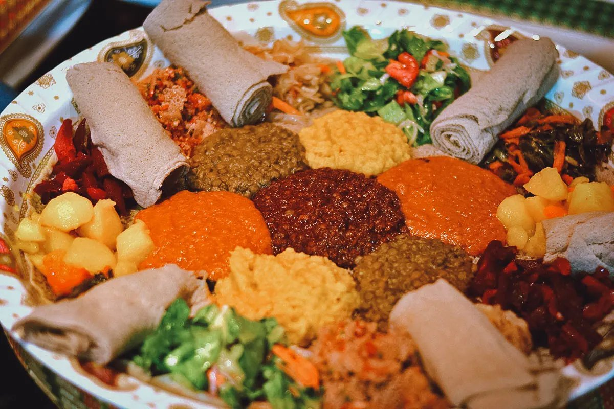
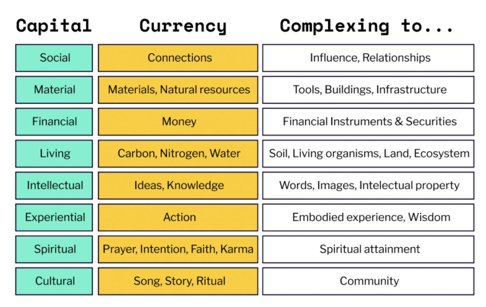
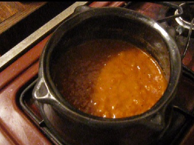
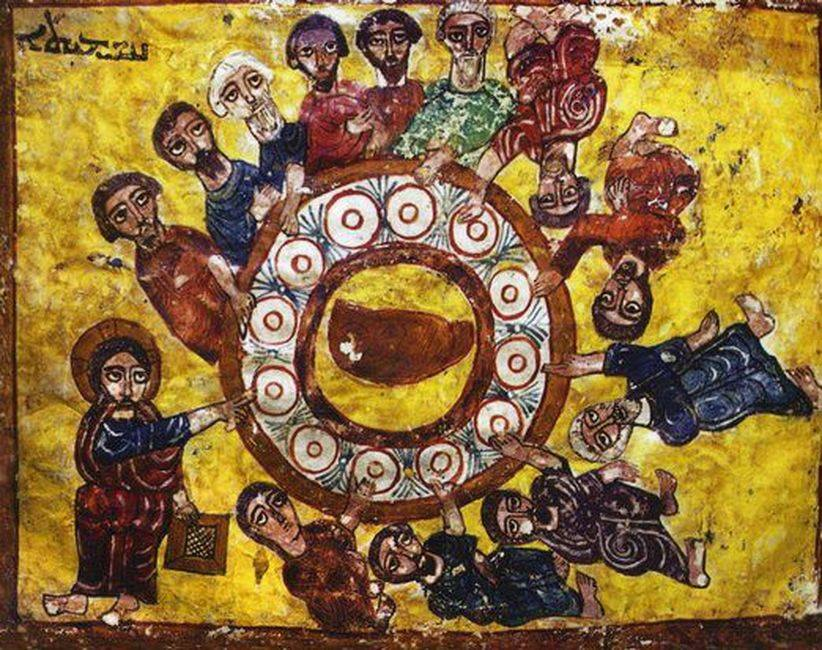
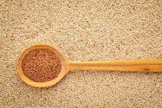
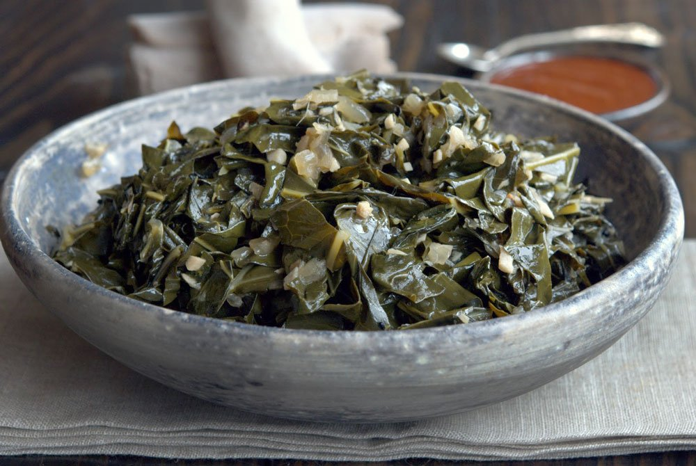
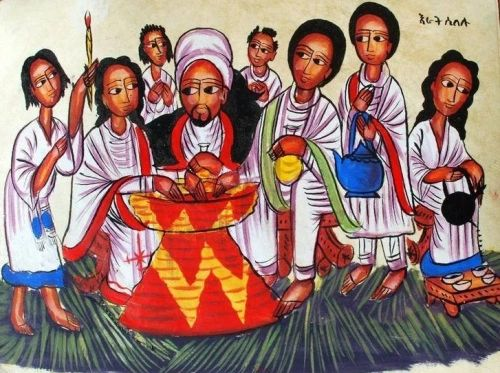
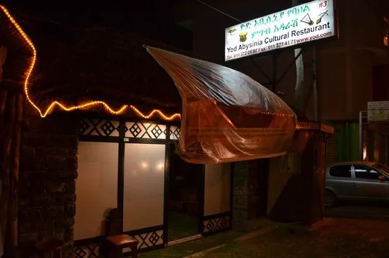

### Does your food have eight forms of capital in it?

*September 1, 2022*

> Originally published on [Mirror](https://mirror.xyz/cerv1.eth/jpe5NGhHDL-1JjtY2jE0MYbc055cfP-138jDBhZ2Z9A). Archived here from Arweave (tx `W0wfWmkHB0Krg_HQwr0L9T5p829w4AgR8lYjL4pB5a0`).

Food is more than just a calorie-delivery mechanism. It has cultural and spiritual significance in many communities. Its cultivation and consumption have a direct impact on the material and living world. It contributes deeply to the social and experiential fabric of our lives.

What are some of the dimensions beyond taste and nutrition that we can use to describe the value of food? What makes for a truly **rich** food? 

Before answering those questions, let me first share a personal story about a favorite food of mine. It’s a food that I believe is among the most valuable foods on Earth!

## Backstory: My History With Ethiopian food

I grew up in Rhode Island, in a family that would rarely go out for dinner. 

My father, who immigrated to the US from Italy as a teenager, did all the cooking at home. This meant that six out of seven nights a week we’d eat pasta for dinner. And, if we went out for dinner, it was usually to an Italian restaurant on [Federal Hill,](https://en.wikipedia.org/wiki/Federal_Hill,_Providence,_Rhode_Island) Providence’s Little Italy.

So it was unlikely that I would be exposed to Ethiopian food at an early age.

But I had an older cousin who lived in Boston. An adventurous college student, she invited us out for Ethiopian food one night.

I was probably only seven or eight years old, but I remember the experience vividly. The restaurant was dim and spacious. We sat on the floor, surrounding a large basket that served as our table. The food was like nothing I’d experienced before -- rich, full of unfamiliar flavors and textures. We ate with our hands.

It felt like a celebration, an occasion centered on the food, which we all partook in as equals; not an occasion centered on grown-up talk with a kid’s meal and placemat for me to draw on.

I’m assuming what we ate was *beyaynetu*.

If you’ve ever had Ethiopian food before, then you’ve most likely had beyaynetu. It’s a colorful spread of different vegetarian sauces served on a large roll of *injera*.

This is what it looks like.

We went to the Ethiopian restaurant in Boston a handful of times after that. If we were going to Boston, that was my one request. It was something I looked forward to for days in advance. 

In middle school, I created a kid’s cookbook that included a recipe for *injera* in it. As I got older and became more independent, I sought out Ethiopian food whenever I had the chance. 

In 2007, I visited Ethiopia for the first time. I would go on to live in Addis Ababa from 2008-2013. I still travel to Ethiopia often, and seek out Ethiopian food whenever I’m exploring a new city with a large Ethiopian diaspora. 

## The Eight Forms of Capital

I recently learned of a concept called the “Eight Forms of Capital”. It provides some new language for thinking about the value of things. 

The idea was first published in a blog post on [AppleSeed Permaculture](http://www.appleseedpermaculture.com/8-forms-of-capital/) by Gregory Landua and Ethan Roland. 

The Eight Forms of Capital are:

* Social capital, such as influence and connections.
* Material capital, non-living physical objects, both raw and processed
* Financial capital, currencies and other tools of the global financial system
* Living capital, living beings including plants, animals, and soil
* Intellectual capital, knowledge learned from a book or school
* Experiential capital, knowledge gained by doing
* Cultural capital, shared knowledge of a community
* Spiritual capital, religion, spirituality, or other means of connection

The most important takeaway is that there’s more than just *financial* capital. Even in your food.

Ethiopian food -- and beyaynetu in particular -- is rich in all eight forms of capital. I think this is what has captivated me about it ever since childhood.

Here’s what I mean.

### 1. SOCIAL

At meals in Ethiopia, everyone gathers round and eats off of the same spread. It doesn’t matter if you are lifelong friends or new acquaintances.

People feed each other (”gursha”). With their hands. It’s a sign of unity and togetherness.

[https://twitter.com/ObangMetho/status/1172593051702910976?s=20&t=fKQOB6-nfI_TRRFVUKZuWw](https://twitter.com/ObangMetho/status/1172593051702910976?s=20&t=fKQOB6-nfI_TRRFVUKZuWw)

### 2. MATERIAL

Ethiopian stews (a.k.a *wots*) are cooked in clay pots.

There are no plates or silverware -- just injera, which you eat, and your hands.

There are no napkins -- water is brought to you before and after eating to clean.

### 3. FINANCIAL

Yes, you can purchase Ethiopian food with money at a restaurant. However, it will never taste as good as a home-cooked meal.

Beyaynetu is a staple food eaten by the rich and poor, peasants and emperors.

### 4. LIVING

Injera is made from [teff](https://thelovegrass.com/), a lovegrass native to Ethiopia.

Farmers grow teff in rotation with lentils & split-peas, which are [nitrogen-fixing](https://en.wikipedia.org/wiki/Nitrogen_fixation#Legume_family). They take advantage of [bacteria already in the soil](https://juniperpublishers.com/artoaj/ARTOAJ.MS.ID.556001.php) to capture nitrogen from the air -- essentially making their own fertilizer.

### 5. INTELLECTUAL

A typical Ethiopian spread is full of kale, collard greens, carrots, lentils, and split-peas. These foods are rich in brain-healthy nutrients like vitamin K, lutein, folate, and beta carotene.

Plus, the darker the injera is, the more iron it has in it. Ethiopian food is good for your brain and your body. 

It also carries deep ancestral wisdom. Recipes have been passed on for generations. There are no cooking schools. There is only learning as an apprentice.

> “Individual family matriarchs would experiment and add their own unique additions to their spice blends, tweak recipes and techniques, perfecting them through the years.”
>
> \--Tsehai Fessehatsion

Methods for fermenting and baking injera, for cooking and seasoning the stews, maintain a close connection to the land and reflect the unique constraints and gifts of the Ethiopian highlands.

### 6. EXPERIENTIAL

Ethiopians give great attention to the experience around the meal.

At feasts and holidays, people wear traditional clothes, dance. They sit on traditional 3-legged stools, eat off woven baskets.

Meals are completed with fresh coffee, roasted on the spot.

### 7. SPIRITUAL

Ethiopia is a pluralist nation with different religions and ethnic groups all sharing the same food. “National” food has the same meaning anywhere you go, regardless of other regional specialties.

Beyaynetu is halal, kosher, & “fasting”. Fasting is what Ethiopian Orthodox Christians call food that is free from animal products, effectively vegan food. Orthodox Christians are expected to fast for \~180 days, including the lent period before Easter and on Wednesdays and Fridays throughout the year.

[https://twitter.com/MarcusCooks/status/1039999666933256192?s=20&t=fKQOB6-nfI_TRRFVUKZuWw](https://twitter.com/MarcusCooks/status/1039999666933256192?s=20&t=fKQOB6-nfI_TRRFVUKZuWw)

### 8. CULTURAL

Eating Ethiopian food is a celebration of Ethiopian culture & heritage.

Sharing a meal - and receiving a “gursha” (someone else feeding you) - is the most important induction into Ethiopian culture.

The most famous Ethiopian restaurant in Addis Ababa, [Yod Abyssinia](https://www.tripadvisor.com/Restaurant_Review-g293791-d1477419-Reviews-Yod_Abyssinia_Traditional_Food-Addis_Ababa.html), bills itself as a “cultural restaurant”. It fills up each night with families, friends, tourists, office workers, and partygoers looking for much more than a good meal. 

## Seeing the Eight Forms of Capital Everywhere

Once I grokked the Eight Forms of Capital, I started looking at everyday objects in a new light.

> “Much of our food system depends on our not knowing much about it, beyond the price disclosed by the checkout scanner; cheapness and ignorance are mutually reinforcing.”
>
> \-- Michael Pollan

White bread, for example, may be rich in financial capital: it’s cheap to consume and profitable to produce. But it is exceedingly poor in other forms of capital.

When we only prioritize financial capital, we miss out on the richness of ancestral wisdom and culture. We neglect the living and material connections to our food.

Natural wine, on the other hand, is rich in all forms of capital. Each producer, each vintage offers a wealth of latent value. No two wines are alike. And this value manifests in an equally rich range of settings and contexts at the time of consumption. Sometimes an occasion calls for a specific wine and sometimes a wine calls for a specific occasion. 

These are the types of foods we need to seek out and create more of. We need much more than financial capital in our world to make us healthy and whole. We need foods that regenerate our land, our bodies, and our communities.

I encourage you to reflect on that the next time you eat a meal -- and to share it with the people sitting next to you.

