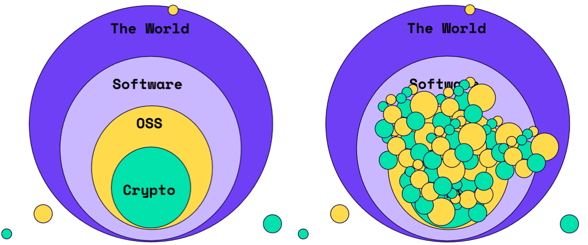
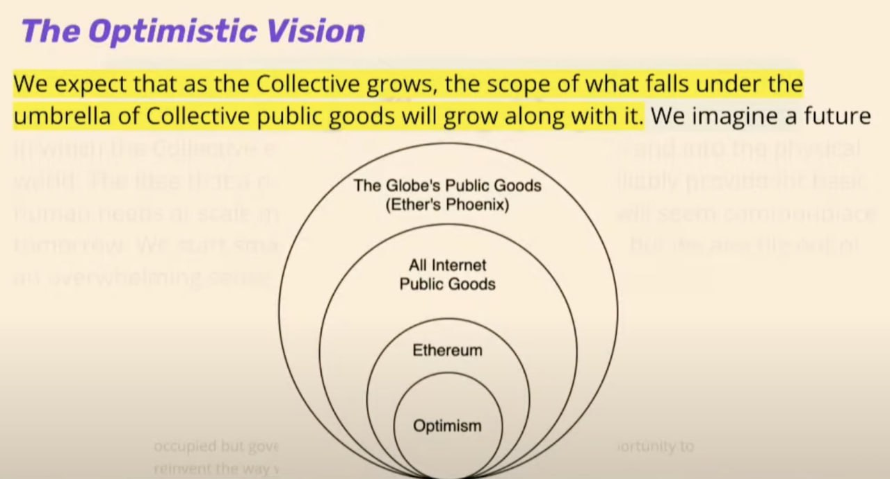
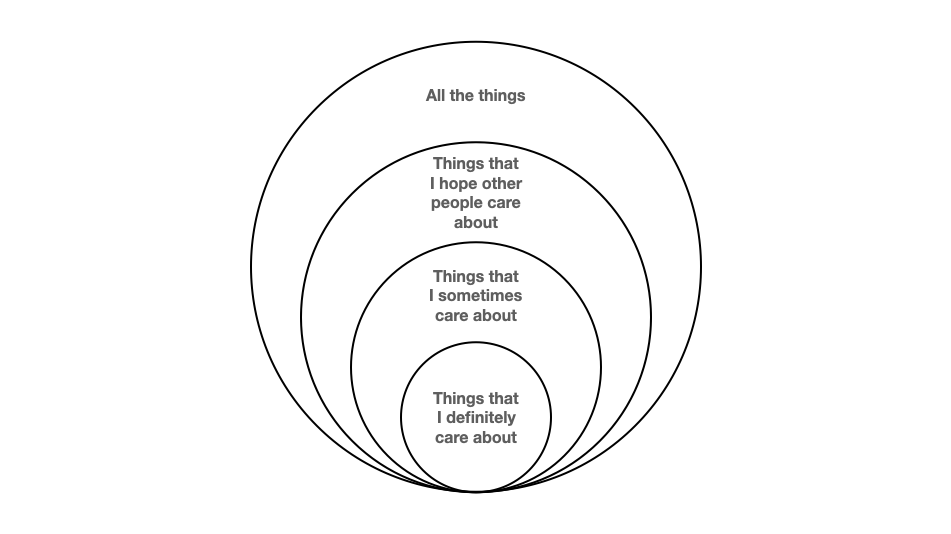
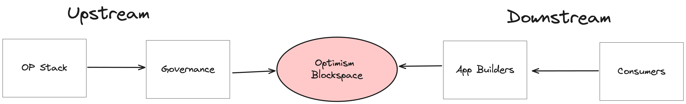
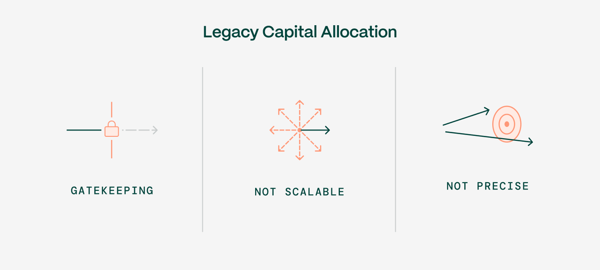

### Exporting public goods funding beyond our immediate circles

*May 8, 2024*

> Originally published on [Mirror](https://mirror.xyz/cerv1.eth/o02WqmO5mI741RDB7zwkx7cw5l0EqsgrDFdUhUootpA). Archived here from Arweave (tx `xa3jHn3Wg2fXq7PJaUUqx5QK1mPukpVsRzlUaZXkPEE`).

> *This post is inspired by the work and thought leadership of organizations explicitly mentioned (Gitcoin, Optimism, Drips, Superfluid, Hypercerts, etc) as well as various conversations with Juan Benet and Raymond Cheng regarding the features of network capital vs private capital.*

### **Every funding ecosystem has domains that are core and domains that are important but peripheral**

Gitcoin visualized this concept of nested scopes nicely in a [blog post](https://gov.gitcoin.co/t/a-vision-for-a-pluralistic-civilizational-scale-infrastructure-for-funding-public-goods/9503) in 2021. The original post described a stack of impact funding mechanisms, initially concentrated in the inner circle (“crypto”), spilling over to the next circle (“OSS”), and eventually eating the world.

It’s a good way of saying: *Start by solving problems close to home and scale from there.*

Optimism has also [used](https://www.youtube.com/live/TXlQY7T2xJE?si=oYIXACk1FcbHD7CJ&t=896) a similar visual in explaining its vision for retroactive public goods funding.

Optimism is within Ethereum.  Ethereum is contained within “all internet public goods”. And “all internet public goods” is contained within “the globe’s public goods”. Each of the outer domains is a superset of the domains inside of it.

Here’s my generalized version of the four concentric circles meme.

Even though I personally may spend zero time thinking about biodiversity in the deep sea or [noise pollution in Kolkata](https://www.soundproofcow.com/top-10-loudest-cities-world-live/), there are many people who definitely care about those things. Simply becoming aware of something often moves it from the “all the things” to the “things that I hope other people care about” circle.

### **Most of us are not well-equipped to evaluate important things outside our proximate circle(s)**

We can usually do a reasonable job evaluating things we are close to on a day-to-day basis. This is our inner circle or the things we definitely care about.

In an organization, one’s inner circle might include your teammates, projects you work with closely, tools you use regularly, etc.

We can also evaluate some (but probably not all) things that are one degree upstream or downstream from our day-to-day circle. These are things we *sometimes* care about.

In the case of a software package, upstream might be your dependencies and downstream might the projects that depend on your package. In the case of an educational course, upstream might include valuable curricula or resources that influenced the course, and downstream might include students who recommend the course to their friends.

Both software developers and educators can look even further upstream to research, to the institutions that stewarded that research, and so on. Now we are in the realm of caring about *all* of the things.

However, most reasonable people stop caring deeply about *any* of the things at this point. Once we go beyond one degree of separation, it gets murky. These are things we *hope* other people care about.

### **The risk is we use distance as an excuse NOT to fund these things and perpetuate the free rider problem**

While it may be true that everything in our inner circle depends on the outer circles remaining well-funded, it’s hard to justify contributing more than one’s “fair share” (however one might attempt to calculate this) to things that are more than one circle away. There are good reasons for this.

First of all, it’s hard to triage within large domains. A category like “all internet public goods” is sufficiently broad that, if you squint, you can make the case for pretty much anything fitting inside it and deserving funding.

Second, it’s hard to motivate stakeholders to care about funding things outside their proximate circles because the impact is so diffuse. I’d rather fund a whole person on a team I know than a faceless fraction of a person on a team I don’t know.

Finally, there’s no immediate consequence to *not* funding these things - assuming, of course, that everyone else continues to fund them and doesn’t defect.

Thus, we arrive at the classic free rider problem.

Apart from governments, which have the ability to print money, collect taxes, and issue bonds to pay for long-term public goods projects, we as a society don’t have good mechanisms for funding things outside of our most immediate circles. Most capital is routed to things with shorter-term returns and more proximate impact.

One way of solving this is to have people focus on funding things that are close to them (i.e., things that they can assess personally) AND to build in mechanisms for continually pushing some portion of funding outward to the edges.

Incidentally, this is how private capital flows. There are some features of private capital we should try to emulate.

### **The venture capital model for funding things with no short/medium-term payback works because private capital is composable and easy to fractionalize**

There’s a model for funding hard tech with 5-10+ year paybacks: it’s called venture capital. Sure, in any given year, the magnitude of funding that goes to projects with long time horizons is influenced more by interest rates than by terminal values. But VC is a proven model in the sense that it’s been able to attract and deploy trillions of dollars over the past several decades.

The model works in no small part because venture capital (and other sources of investment capital) are composable and easy to fractionalize.

By composable, I mean  you can receive VC funding and also have an IPO, get a bank loan, issue bonds, raise capital through more exotic mechanisms, etc. In fact, you’re expected to. All of these funding mechanisms are interoperable.

These mechanisms compose well because there are explicit commitments about who owns what and how cash gets distributed under different scenarios. Indeed, most companies utilize a range of financing instruments during their lifetime.

Investment capital is also easy to fractionalize. Many individuals pay into the same pension fund. Many pension funds (and other investors) LP into the same VC. Many VCs invest into the same company. All of these fractioning events happen upstream of the company and its day-to-day concerns.

These features make private capital highly effective at flowing across a complex network graph. If a VC-backed company has a liquidity event (IPO, acquisition, etc), the returns are distributed efficiently between the company and its VCs, the VC and its LPs, the pension fund and its retirees, even from the retirees to their children.

This is NOT how funding flows across networks of public goods. Instead of a large patchwork of irrigation channels, we have a relatively small number of massive water towers (governments, major foundations, high net worth individuals, etc).

To be clear, I am not advocating for VC funding for public goods per se. I am only pointing out two important features of private capital that don’t have an equivalent in public capital.

### **How we might get more public goods funding to flow beyond our immediate circles**

Optimism recently announced new plans for [retro funding in their ecosystem](https://gov.optimism.io/t/upcoming-retro-rounds-and-their-design/7861).

In the last round of Optimism’s retro funding, there was a very wide aperture of things that could be funded. For the foreseeable future, the scope will be much narrower, targeted on the more proximate upstream and downstream links in their value chain.

It should be no surprise that the feedback has been mixed about these changes. Many projects that were in scope historically are now outside the scope of upcoming rounds.

The first of the newly announced rounds is earmarking 10 million tokens for “onchain builders”. Onchain builders received a [disproportionately small share](https://gov.optimism.io/t/new-rpgf3-distribution-disparity-data/7521) of funding during Round 3 - only about 1.5 million of the total 30 million that was up for grabs. What would these projects do with 2-5X times the retro funding?

One thing they *could* do is put some of the tokens into their own retro funding or grants rounds.

Concretely speaking, if Optimism funded DeFi apps that drive network usage, then those apps could fund the frontends, portfolio trackers, etc that enable whatever impact those apps care about.

If Optimism funded dependencies that are core to the OP stack, then those teams could fund their own dependencies, research contributions, etc.

*What if projects take the retro funding they feel they deserve and recycle the rest?*

This is already happening in various forms. Ethereum Attestation Service now has a [fellowship program](https://attest.org/fellowship) for teams building on top of its protocol. Pokt just [announced](https://www.pokt.network/blog/launching-retro-pokt-goods-funding) its own retro funding round, rolling all of the tokens it received from Optimism (and Arbitrum) into the round. Even [Kiwi News](https://news.kiwistand.com/), a below-median recipient in Round 3, has implemented its own version of retro funding for community contributions.

Meanwhile, [Degen Chain](https://www.degen.tips/) has pioneered an even wilder concept of giving community members token allocations that they have to give away in the form of “tips” to other community members.

All of these experiments are routing public goods funding from central pools (like the OP or Degen treasury) to the edges, expanding their circle of influence.

*The next step is to start making these commitments explicit and verifiable.*

One way of doing this might be to have projects determine a **floor value** and a **percentage above the floor** that they’d be willing to put into their own funding pool. For instance, maybe my floor value is 50 tokens and my percentage above the floor is 20%. If I receive a total of 100 tokens, then I would allocate 10 tokens (20% of the 50 tokens above my floor value) to funding the edges of my network. If I only receive 40 tokens, then I keep all 40.

(FWIW, my project did something like this as well during the last round of Optimism funding.)

<https://x.com/carl_cervone/status/1745238904217690174>

In addition to pushing more funding to the edges, this would also serve a critical function of helping establish a cost base for public goods projects. Over the long run, the message to projects that continually receive less than expectations is that they are mis-pricing their work or its undervalued by the ecosystem they’re getting funding from.

Projects that have surpluses will be evaluated in subsequent rounds not just for their own impact but for the broader impact they create by being a good capital allocator. Projects that don’t want the overhead of running their own grants program should have options for parking that surplus in other productive places, like the Gitcoin matching pool, Protocol Guild, or maybe even burning it!

In my view, the two values determined by projects ahead of receiving their funding should remain a secret. If a project receives 100 and gives 10 away, no one else should know whether their values were (50, 20%) or (90, 100%).

*The final step is to plug these systems into each other.*

The examples of EAS, Pokt, and Kiwi News are encouraging, but they all require standing up new programs, then claiming / swapping / transferring grant tokens to new wallets, and eventually transferring funds to a new suite of recipients.

Protocols like [Drips](https://www.drips.network/), [Allo](https://docs.allo.gitcoin.co/overview), [Superfluid](https://www.superfluid.finance/), and [Hypercerts](https://hypercerts.org) provide underlying infrastructure for more composable grant flows - now we need to connect the pipes, like this pilot from Geo Web.

<https://twitter.com/thegeoweb/status/1760320354394771577>

### **The job for this cycle is to create public goods funding systems that truly work. Then, we start exporting them.**

In crypto, we are still at the stage where we are experimenting with lots of mechanisms for deciding what to fund and allocating funds. And public goods funding rails are still an order of magnitude less sophisticated / composable / battle-tested than DeFi’s.

For any of this to scale beyond the experimentation stage, we need to solve for two things:

1. Measurement not only that this stuff works but that *it works better* than legacy models of public goods funding (see [this post](https://docs.opensource.observer/blog/impact-data-scientists) on why this is an important problem for people to work on and [this post](https://docs.opensource.observer/blog/gitcoin-grants-impact) with some longitudinal analysis on Gitcoin’s impact); and

2. Explicit commitments for how “profit” or surplus funding flows to outer circles.

In venture capital, there is always an investor behind the investor - and eventually it’s your grandmother (or, more aptly, all of our grandmothers). Each one of these investors is incentive-aligned to allocate capital effectively in order to be entrusted with a large share of capital to allocate in the future.

For public goods, there is always a set of proximate actors, both upstream and downstream of your work, that you depend on. But there is currently *no commitment* to sharing surplus back with these entities. Until such commitments become the norm, it will be difficult to scale public goods funding beyond our immediate circles.

I don’t think it’s enough to pledge "when we get to a certain size, then we will fund those things”. It’s too easy to shift the goalposts. Rather, these commitments need to be built in as soon as possible, incorporated as primitives in the funding mechanisms and grants programs that get built.

I don’t think it’s reasonable to expect a few whale treasuries to fund everything either. That’s the water tower model we currently have in traditional governments and large foundations.

But, the more we make explicit commitments to funding our dependencies while we’re still small, the more we signal that there is indeed a marketplace for public goods, we grow the TAM, and we shift the incentive landscape.

Only then will we have something that’s truly worth exporting, something that will gather its own momentum and create the “pluralistic, civilizational scale infrastructure for funding public goods” of our dreams.

