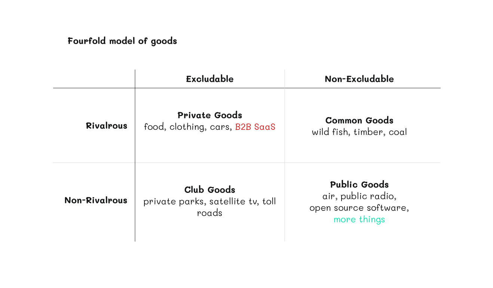
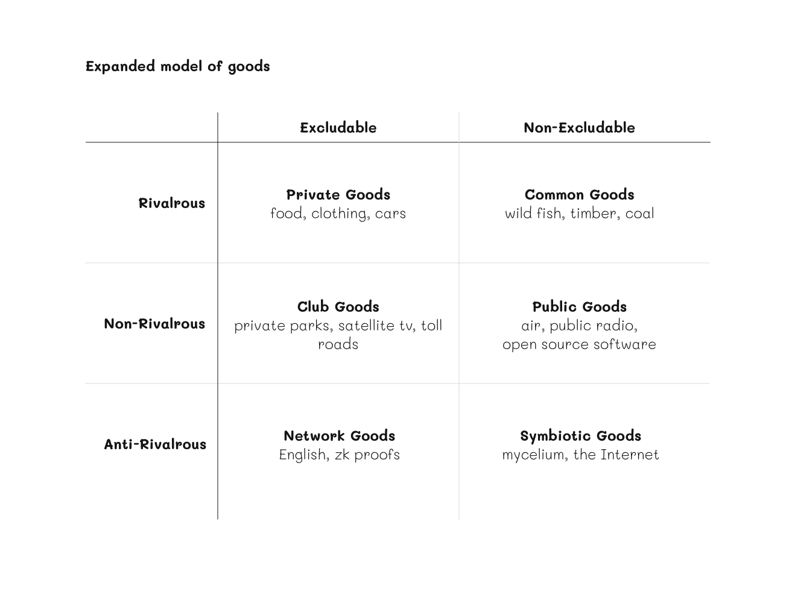

### Reflections on Funding the Commons

*June 26, 2022*

> Some quick thoughts after attending the [Funding the Commons](../assets/pdf/fundingthecommons2022.pdf) event in New York this past week.

### 1. Funding models & incentives need to be reinvented

The event gave out t-shirts with the following quip on them:

> Do you want to *fund enterprise B2B SaaS* for the rest of your life, or come with us and change the world?
> 
> — not Steve Jobs

Although the majority of the people at the event seemed to be builders and researchers (not VCs), the call to action still resonated.

Basically we need to go from funding lots of things in the top left box to putting much more funding into things in the bottom right box. 

Enterprise B2B SaaS *viz.* engineering hard to learn, hard to exit software for large corporations is basically the epitome of an excludable and rivalrous good.

However, the traditional models & incentives of funding public goods in the bottom right are broken. It's either unfunded or left to the domain of governments and do-gooders. 

In the case of the nonprofit sector:

- Funding is primarily given in the form of grants
- Grant applications typically require waterfall style execution and planning, with funding linked closely to the cost of each activity

Therefore, the organizations that tend to attract the most funding are:

- Good at grantwriting
- Good at executing projects according to plan

These models have their place (as does Enterprise B2B SaaS). But there is ample room and urgent need for new models and incentives.

Gitcoin Grants (with quadratic funding) and retroactive public goods funding came up repeatedly during the event. I'd like to see much more of both of these models - and new ones too.

All this inspired a quick rework of the fourfold model to include the anti-rivalrous.

Divya Siddharth gave an extremely compelling [talk](https://www.youtube.com/watch?v=jT3riInwd5c) challenging us to view each of these elements not as boxes but as a spectrum. She remarked that some exclusion is often necessary but we have historically erred on the side of excluding too much, reducing the potential positive returns of a network for its users.

### 2. Impact certificates are a necessary primitive

In Juan Benet's [keynote](https://youtu.be/kGs3IdHj5_4?t=3610), he sets a stretch goal for the sector of launching 3+ impact markets, with >$50M in value, over the year ahead.

I like that this is a well-bounded challenge. It shows how nascent the "impact market" space is. (The NFT market does $50M in value [every couple days](https://nonfungible.com/market-tracker).) It represents a scale at which the space starts becoming big enough to pay attention to. 

I also appreciate Juan's desire to have multiple markets operating because: pluralism.

In order to create a liquid market for impact, there need to be credible and open standards for demonstrating proof of impact. That's where impact certificates, verified impact credentials, or other mechanisms come into play.

Two examples of impact certificate implentations came up on Day 1 of the event:

- [Risk Adjusted Bonding Curves](https://github.com/BlockScience/Risk-Adjusted-Bonding-Curves), aka Alpha Bonds, presented by Shaun Conway of [ixo](https://www.ixo.world/).
- [Hypercerts](https://www.youtube.com/watch?v=acbBeGcevok&t=887s), presented by David Dalrymple of [Protocol Labs](https://protocol.ai/)

Kevin Owocki has also called out the importance of [impact certificates](https://gov.gitcoin.co/t/impact-certificates-proposals-wanted/10499/7) and [impact ratings](https://gov.gitcoin.co/t/proof-of-impact-proposals-wanted/10179) to improve the quality of Gitcoin Grants.

I have some ideas on this, which I'll put into a separate post.

### 3. I'm not ready to give up on Effective Altruism... yet

I love the pluralistic, bottom-up ethos of the web3 community and most present at Funding the Commons.

But I also worry that we won't be able to coordinate to solve the "biggest" problems, especially problems that are known unknowns like nuclear war, Artificial General Intelligence, and climate change.

This past week, I funded [50+ grants](https://twitter.com/carl_cervone/status/1539612355331506180?s=20&t=AXqlfSvciLZXgZNPBcdWew) on Gitcoin Grants. None of the grants I funded were working directly on nuclear deescalation or AGI.

The very act of determining what problems rise to the top of the stack is hard. It requires experts to make a Drake Equation-esque model to estimate the probability. 

That type of work leads to efforts like [Effective Altruism](https://forum.effectivealtruism.org/), which regularly updates its top global concerns based on the latest research and risk-weighted probabilities.

The reality is that most of us are much more interested in focusing on known knowns that impact us directly. Climate change is #6 on this list from Pew below. AGI and nuclear war aren't on it.

I think the optimal solution is some marriage between the rigor and long-termism of effective altruism and the humility and collaboration of practical pluralism. 

That, plus, new funding models and better incentives for both.