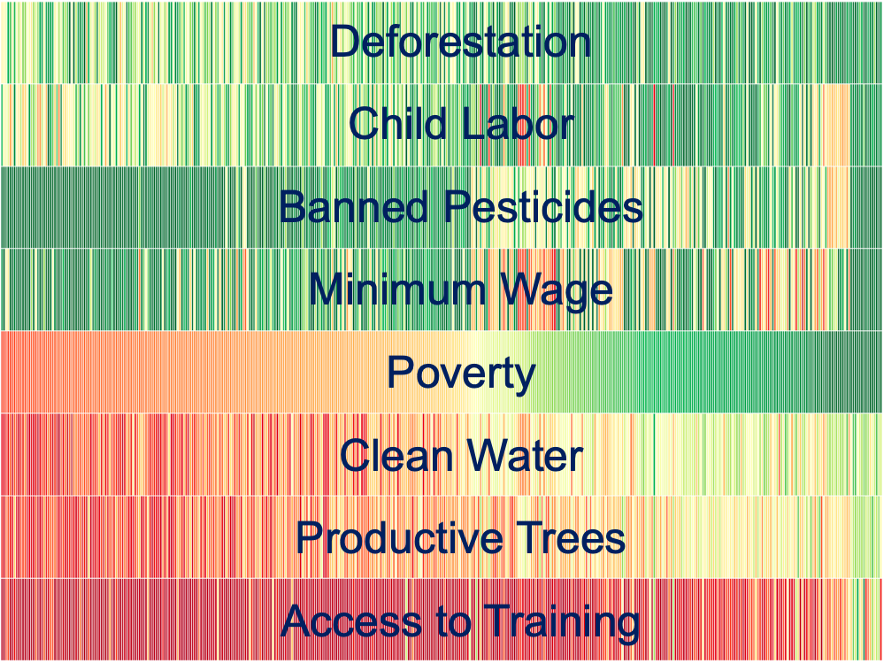

### It’s 2020: The role data can play in achieving the next decade’s sustainability targets

*February 14, 2020*

> This essay was originally published in the June 2020 edition of the [African Fine Coffees Review Magazine](https://afca.coffee/wp-content/uploads/2020/04/AfricanFine-CoffeesReviewMagazineApr-Jun2020.pdf)

Enveritas verifies coffee purchases for traceability, sustainability, and positive impact.

We’ve developed technology that can identify the features of coffee farms from satellite imagery. We use it to map entire communities and growing regions. Then we identify a statistically representative sample of farms from within those communities. We send trained enumerators to those points to speak to farmers, workers, and verify sustainability conditions on-site. Participation is voluntary and free for farmers. Individual farmer data is anonymous and confidential, but we analyze trends across populations of farmers at a regional level. 

At our core, what we are doing is talking to farmers and capturing their work, their challenges, their successes. We talk to farmers like Cecilia in Guatemala, a young female farmer with one cuerda of coffee; like Joao in Brazil, whose farm in the Cerrado is fully mechanized; and like Shibiru in Ethiopia, who has 3.5 hectares of young coffee growing at over 2000 meters.

# A Snapshot of Sustainability in 2020

The graph below represents a snapshot of what we’ve observed across one-third of the coffee world in 2019. It’s a complicated graph, so here’s an explanation of how to read it.

Each vertical slice is a community of coffee farmers somewhere in the world. There are 416 slices on this page, each representing a community of coffee farmers that we verified last year. The colors represent the state of progress on a particular sustainability topic. Green means more progress, red means less progress.

One of the fundamental issues in most coffee communities is poverty. It’s 2020 and nearly half of the world’s coffee farmers and their families live in poverty. The chart is sorted by poverty levels, so on the left, where you see the darkest red, you have communities where most farmers live below the $3/day poverty line. And on the right, you have communities that are dark green and extreme poverty is no longer an issue.

Deforestation and child labor are hotspot issues. There are pockets and places with more significant challenges on these issues.

Banned pesticides and minimum wage are other hotspot issues. For these two issues, we observe lots of dark green on the left and then again on the right of the chart. The simple interpretation is that the poorest farmers don’t purchase any pesticides or hire any workers, so they are “green by default”. As incomes increase though, they are likely to start using pesticides and hiring workers and lose this status. All the way to the right, where incomes are highest, we see another group of farmers who are all “green”. This time it’s by design, not by default. These farmers tend to live in countries where social and environmental requirements are more stringent and have taken deliberate actions to adopt more sustainable practices.

Clean water correlates closely with poverty. Productive trees is another issue with lots of red; this standard captures age of trees and whether they are reaching a reasonable level of productivity given the agronomic conditions in their area. Finally, access to training, which is also mostly red across the coffee world.

There are other insights we could draw from this chart. But, an important takeaway is that no one is all green. No community has fixed everything, even just this small set of eight issues. (We look at many more issues than just these.)

# The Good News

The good news is that the data also shows clear signals of improvement, things that are working. 

While a lot of our work is about verifying entire communities and regions of farmers, we also verify “fully traceable” groups of farmers, like cooperatives, farmer programs organized by exporters, and out-grower schemes. We can compare them to similar farms in the same region. When we do that, clear differences stand out. We can verify that positive impact is real and quantifiable.

We can also go very deep into specific issues and look at change over time. For example, in Vietnam, a recent ban on paraquat has been enforced. Across the 54 communities we work in there, we’ve seen a more than 50% drop in paraquat use in one year.

El Salvador was one of the countries most affected by the coffee leaf rust (roya) outbreak in the 2010s. World Coffee Research, for example, is working hard to establish nurseries and help farmers replant with new varietals. This year 65% of farmers in our sample were replanting a portion of their coffee farm in the last year. 

In Uganda, we see a strong link between helping farmers access formal financial products like savings and credit and reduced likelihood of children missing school to help with coffee farming.

Each of these accomplishments, however, prompts a follow-up question. If paraquat use is falling, what’s it being replaced with? If farmers are replanting, which seed are they using and where are they getting it from? We can help answers those questions too.

But data and insights are only valuable if they can be acted upon. And here we come to the final part of our work. We verify buyers’ actions and contributions to work on these issues.

Doing better requires being transparent about progress and being able to separate the signal from the noise. We’ve created a platform that helps the coffee sector do that, that is free for farmers to participate in, and that can guide us towards an improved state.

When we release this chart in 2030, we hope it’s full of green.