### Maximizing the impact of RetroPGF: a review of RPGF2 and ideas for how data can improve future iterations

*July 12, 2023*

> Originally published on [Mirror](https://mirror.xyz/cerv1.eth/tCjpRODfiYpnKIgPLRplW0lAopVP3no_JmI34dNsAWk). Archived here from Arweave (tx `8QVA496D7lHpyqANYBsrth-q7L-qpLVViPUw6N6L_w0`).

*Co-authored with Raymond Cheng, this piece extends gratitude to Jonas Seiferth and Kevin Olsen for their review of a previous draft and insightful feedback.*

[RetroPGF](https://app.optimism.io/retropgf) has great potential to attract the best builders and users to Optimism.

However, as the L2 space grows more competitive, Optimism needs to maintain its early advantage and ensure it keeps improving the ROI of its grantmaking. Improving ROI means making both the process more efficient for all participants and the allocations more impactful for the ecosystem.

Fundamentally, this requires a shift from vibes-driven to data-driven funding.

Data is critical for badgeholders to transition from working at the middle of the grants funnel (i.e., reviewing individual projects) to working mostly at the top and bottom of the funnel (i.e., deciding what forms of impact matter most and reviewing the distribution formula). 

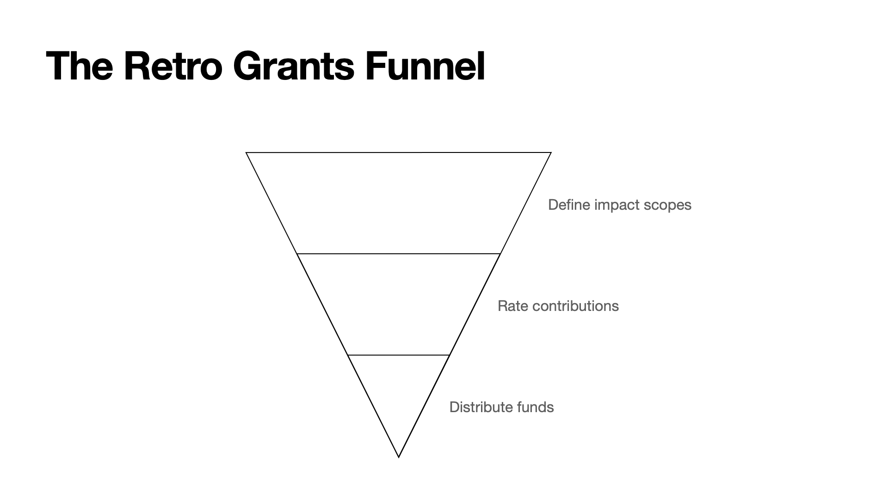

Badgeholders are badgeholders because they care deeply about the health and growth of the ecosystem as a whole, not because they know the intricacies of projects. For most badgeholders, evaluating the quality of a portfolio of projects is a much better way of leveraging their time and expertise than evaluating each individual project. This will become even more apparent as the mechanism scales to more projects.

If one views impact optimization as a reinforcement learning problem, then badgeholders are the humans-in-the-loop giving feedback on algorithm selection.

# The need for structured project data

The recent [RPGF3 announcement post](https://optimism.mirror.xyz/oVnEz7LrfeOTC7H6xCXb5dMZ8Rc4dSkD2KfgG5W9cCw) shows that Optimism is already moving in this direction of more data-driven funding.

First, there will be an emphasis on getting structured project data.

> *In Round 2, voting was high-friction due to low quality project information… Round 3 will introduce more structured project applications to gather better data.*

Second, Optimism wants to enlist the community in impact evaluation.

> *In Round 2, badgeholders had to review nearly 200 projects, many in areas outside their expertise. Round 3 will introduce a process for community-sourced recommendations and curation to allow badgeholders to both vote directly, and incorporate the research and expertise of the community.*

These are great developments. Getting more structured project application data is key to unlocking community-sourced recommendations.

## Decentralizing impact measurement

In order to measure the ROI of Retro PGF, one needs to trace both a project’s work outputs and its finances. 

We conducted an analysis on RPGF2, merging both onchain and off-chain sources. Although we’re currently limited by the lack of structured data, it provided a small taste of what may be possible in the future.

For novel funding mechanisms like Retro PGF to gain traction and [transform funding for digital public goods](https://mirror.xyz/cerv1.eth/I--a872b0kXAI6uFs4wLh_Sq9qAEbiRlA0YLPIqt2TQ), we need solid proof that they outperform traditional funding models.

Before sharing the outcomes of our analysis, here are four key suggestions for enhancing the project application specifications. These improvements aim to enable more insightful project comparisons and permit permissionless impact measurement.

The focus areas include:

1. Creating precise **entity definitions** such as individuals, organizations, and collections. 

2. Verifying **eligibility requirements** for each entity type during the application phase. For instance, an "organization" should control a GitHub organization. 

3. Requiring entities to link at least one source of **public work artifacts**, such as a GitHub repo, a factory contract on OP mainnet, or an RSS feed. 

4. Requiring entities to share a **dedicated address** for receiving grant funds, such as a Safe, splits contract, or ENS.

Most projects already have these details embedded somewhere in their application. Structuring this data for all projects will pave the way for permissionless observation and decentralized impact measurement.

# Insights from RPGF2

Now let’s get into some of our analysis on RPGF2. 

We began by pulling metrics on each project, including data from its GitHub repo and onchain history, and joining this on the data included in the project application. 

We also did some manual matching between the RPGF2 projects and the 500+ projects with contracts on OP mainnet that are being tracked in [this epic Dune dashboard](https://dune.com/optimismfnd/optimism-project-deep-dive). (Interesting note: only 38 of 195 RPGF2 appeared to have contracts on Optimism, implying most of the impact that RPGF rewards is upstream of sequencer fees.)

You can view a summary of the analysis [here](https://docs.google.com/spreadsheets/d/1F_1NFrEyk81bEWJ0nu4qd9WJ73svNyEdgN48Rgl01BU/edit?usp=sharing).

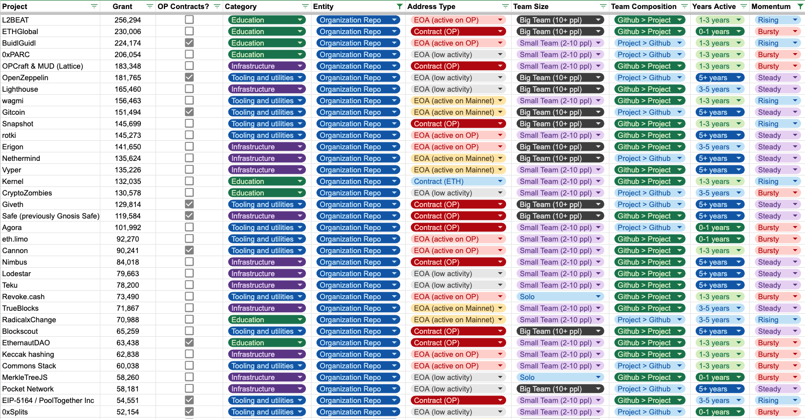

### Project labeling

In their application, projects had to select a **category**. The categories available were infrastructure, tooling & utilities, and education. 

We experimented with adding some additional labels to each project:

* **Entity**. Is the project a dedicated team, a team of teams, or an individual? We derived this mostly from analyzing the projects’ GitHub organization.

* **Address Type.** What type of Ethereum address is associated with the project? We looked for onchain info about the type and usage of the project’s payout address.

* **Team Size**. Roughly speaking, how many people are working on the project? We turned the free text data on the project form into a numeric estimate.

* **Team Composition.** Is the team mostly devs or non-technical contributors? We compared the team size estimate above with pattern analysis of GitHub contributions.

* **Years Active.** How long has the project been around? We analyzed GitHub data all the way back to 2018 for some projects.

* **Momentum.** What does the contribution pattern look like over time? We came up with names for several different patterns of GitHub activity.

### Trends by category

We performed some initial analysis on the funding patterns and composition of projects for the round’s three self-assigned project **categories**. 

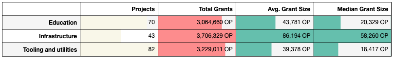

This is old news, so let’s quickly move on to some of the new dimensions we added.

### Trends by entity and address type

> ***Entity****. Is the project a dedicated team, a team of teams, or an individual? We derived this mostly from analyzing the projects’ GitHub organization.*

The most common **entity** type was the “organization repo”, i.e., a dedicated team sharing a common GitHub repo. These were often startups and DAOs. A substantial share of projects were linked to personal repos in their applications, including several large ones with outsized impact like Ethers. Projects without a GitHub linked in their application were mostly in the education category. There were also five projects working primarily on Ethereum repos (e.g., Solidity). We moved Protocol Guild into this category as well.

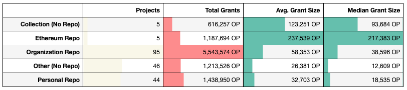

For RPGF3, we recommend creating more precise entity definitions: e.g., individuals, organizations, collections. If these labels are MECE, then no project should be in the “other” category, where it requires specific knowledge to work out what type of team or project it is.

We also recommend making a public GitHub an eligibility requirement, at least for OSS projects. If it’s an organization, then the project should have a GitHub organization. If it’s an individual, then it should be a repo owned by the user’s personal GitHub. For non-OSS projects, there should be thought put into identifying good sources other than GitHub for tracking public work artifacts. 

> ***Address Type.*** *What type of Ethereum address is associated with the project? We looked for on-chain info about the type and usage of the project’s payout address.*

The **address type** dimension differentiated between smart contract-based addresses and EOAs. For EOAs, we also analyzed transaction counts on both Ethereum mainnet and Optimism. A high number of projects (45) set their payout address to an EOA with minimal or no history, suggesting it was created purely for receiving grant funds. Some projects did not have a payout address listed.

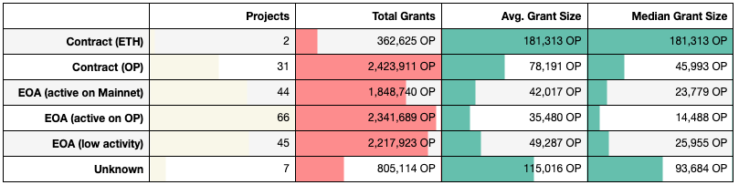

Out of the 195 total projects, 66 were ideal for permissionless impact measurement because they shared both an organization GitHub repo and an address with a robust transaction history. An additional 39 projects, which were either solo or team of team initiatives, had an active GitHub and verified address.

On the other hand, there were 8 projects with no repo or onchain history provided, which made it difficult to evaluate anything about them without doing additional research. 

*Anecdote: the project page for Goerli, which received 140K OP, had no payout address, no GitHub, and no website link (apart from an empty Notion page) in its application!*

As mentioned earlier, we’d like to see organizations adopt a more transparent model of receiving grants through a dedicated address.

### Team size and composition

> ***Team Size****. Roughly speaking, how many people are working on the project? We turned the free text data on the project form into a numeric estimate.*

Most projects indicated a **team size** of 2-10 people in their application. Larger teams tended to receive larger grants. The median solo project received the same grant amount as the median small team project.

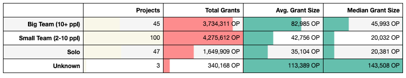

We can extend this analysis to calculate the average grant amount per team member. As projects get larger, the amount of grant funding per contributor becomes less significant. For instance, a project like Flipside Crypto has a team of 80 people, so an average-sized grant of 40K OP works out to just 500 OP per team member. 

The average funding per contributor declines markedly for projects with more than 10 full-time team members.

This inverse relationship between team size and funding per team member is displayed in the chart below. The size of the bubbles corresponds to the total amount of grant funding received from Optimism.

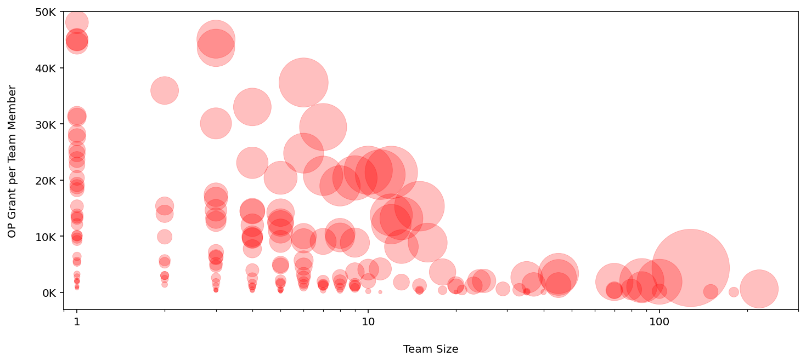

It’s powerful to see solo projects like Ethers and ZachXBT receive grants of more than 100K OP. However, you don’t want to discourage less visible teamwork either. This dynamic is most problematic for the “collection” entities, which received a total of 1.6M OP, split across 418 individual contributors, for an average of just under 4K OP per individual. By comparison, the 47 solo projects received about 1.6M OP, or an average of 35K OP per individual.

This tendency is visualized in the treemap below, which takes all projects that received a grant of at least 35K and creates a box for every team member’s “share”.

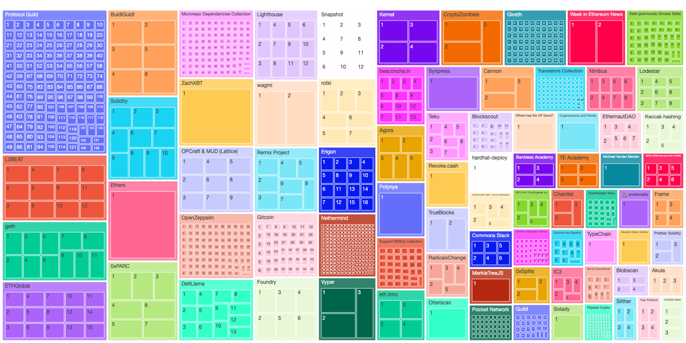

This observation is worth monitoring over future rounds. The current funding mechanism may incentivize builders to focus on visible solo projects rather than less visible team projects.

> ***Team Composition.*** *Is the team mostly devs or non-technical contributors? We compared the team size estimate above with pattern analysis of GitHub contributions.*

For projects with organization repos, more than half appear to have a **team composition** that includes active contributors from the open source community. These projects also received more funding than projects with less active repos / less technical teams.

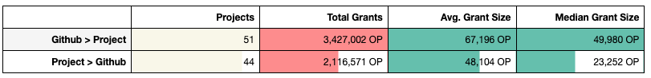

There’s a lot that could be discussed here. Impact measurement methodologies that  rely on GitHub (or other software-related) artifacts are likely overlook the impact of other types of contributors, e.g., to education, user onboarding, or governance. It’s important to identify other public artifacts (such as RSS feeds, attestations, etc) that are better suited to non-software public goods.

The chart below provides more details on the size of projects. The black dot represents the number of contributors derived from the project profile, whereas the colored bars represent the difference between that number and the number of monthly active contributors on the organization’s GitHub repo. Projects with blue bars have more active contributors on their GitHub than listed on the project page. (Safe, for instance, reported 45 contributors on its project page but had an average of 73 monthly active contributors on its GitHub over the past year.) Projects with red bars have fewer contributors on their Github, likely implying they are less developer-focused projects or are part of a larger organization (For example, Messari Protocol Services is a grant-funded, open source arm of VC-backed Messari.)

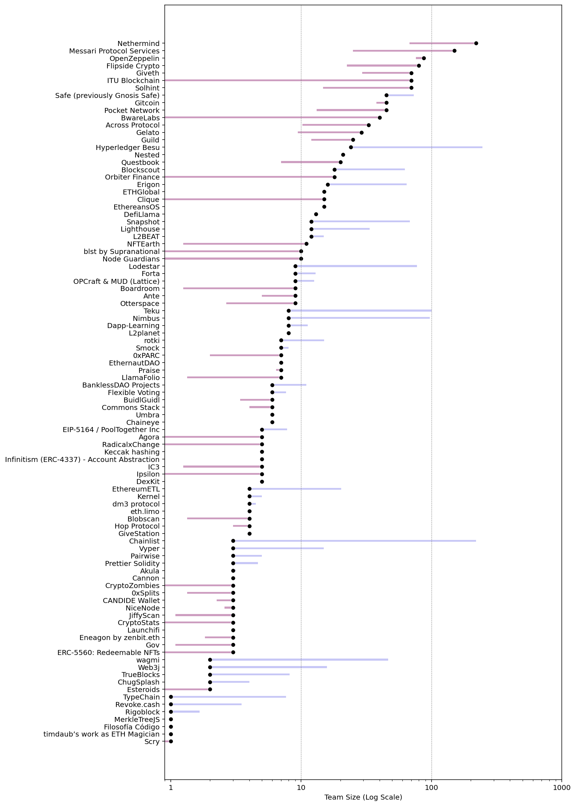

### Years active and momentum

> ***Years Active.**** How long has the project been around? We analyzed GitHub data all the way back to 2018 for some projects.*

In aggregate, projects with more **years active** received more funding – roughly 10,000 OP for every additional year of activity. 

(Note: this indicator is derived solely from GitHub activity and may not always be a good proxy for the actual number of years a project has been around.)

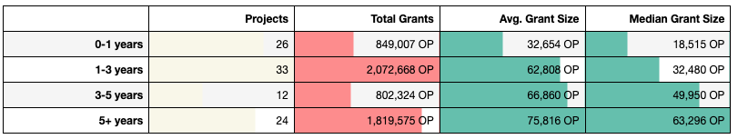

However, the tendency for more established projects to receive more funding isn’t as strong within categories. In education, for instance, newer projects tended to perform better than older ones.

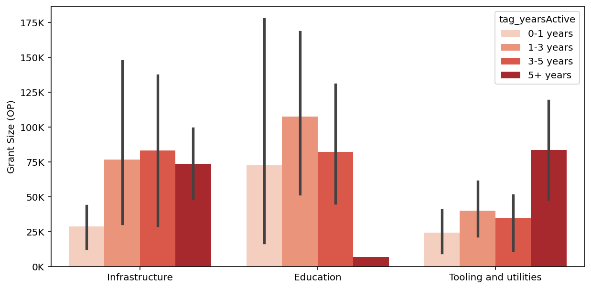

> ***Momentum.**** What does the contribution pattern look like over time? We came up with names for several different patterns of GitHub activity.*

There’s an open question about how retro does Optimism want to go.

Many of the projects have been around for years while others are newer, hopefully rising stars. Should retro-funding  be “exit liquidity” for hardened projects that have stood the test of time and are now in maintenance mode or sunsetted? Or should it be more like “recurring revenue” for projects that are still in active development? This is a clear example of where governance and badgeholders’ preferences are instrumental. 

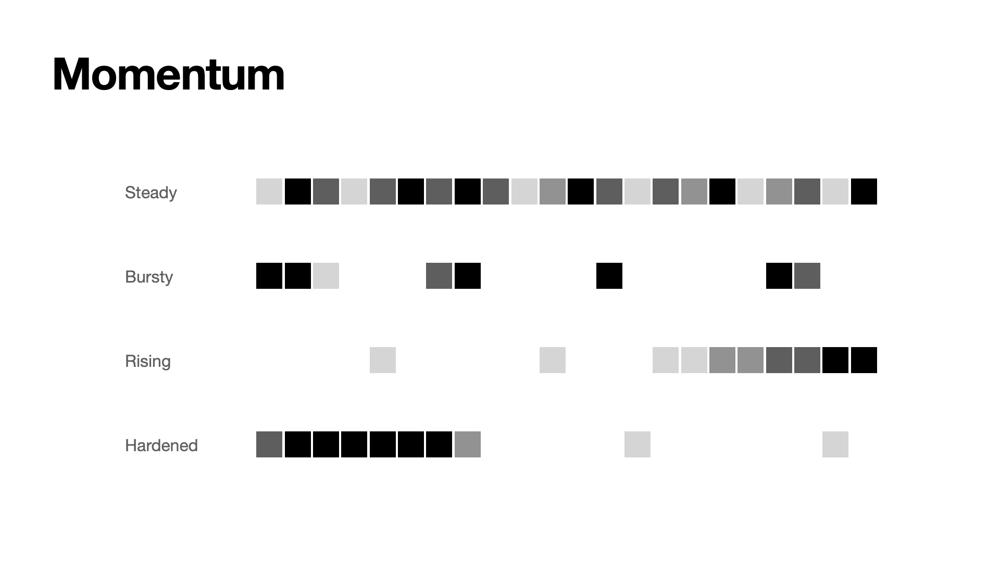

In RPGF2, projects with “steady” **momentum** – i.e., consistent activity on their organization’s GitHub for over two years – received much larger grant sizes on average than newer, “rising” projects and older projects with “bursty” activity. There weren’t any projects with a “hardened” pattern -- though [Goerli](https://github.com/goerli) probably would have met this criterion if its GitHub had been listed in the application. 

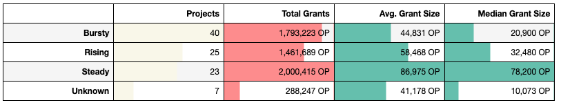

The following charts show a subset of relevant GitHub contribution activities (i.e., pull requests created, pull requests merged, and issues created) over the last five years for each type of momentum.

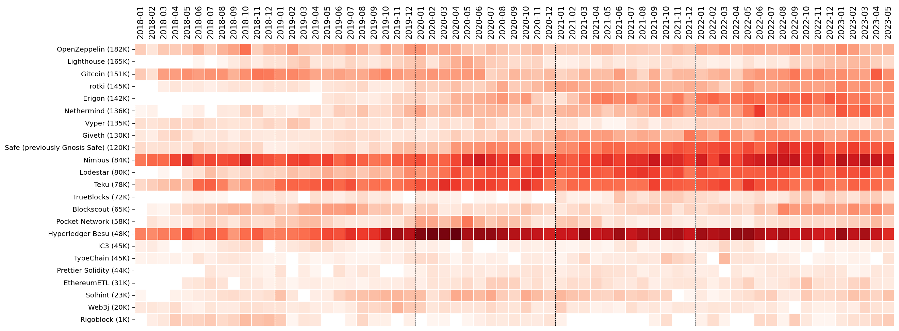

It’s natural to look for projects that have “steady” or “rising” activity. Funding them not only rewards past work but also serves as motivation to keep building. 

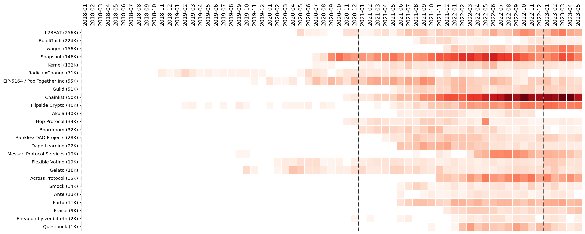

A large number of projects demonstrated a “bursty” activity pattern. CryptoZombies is a good example of one of the more “hardened” projects that has been creating value for a long period of time.

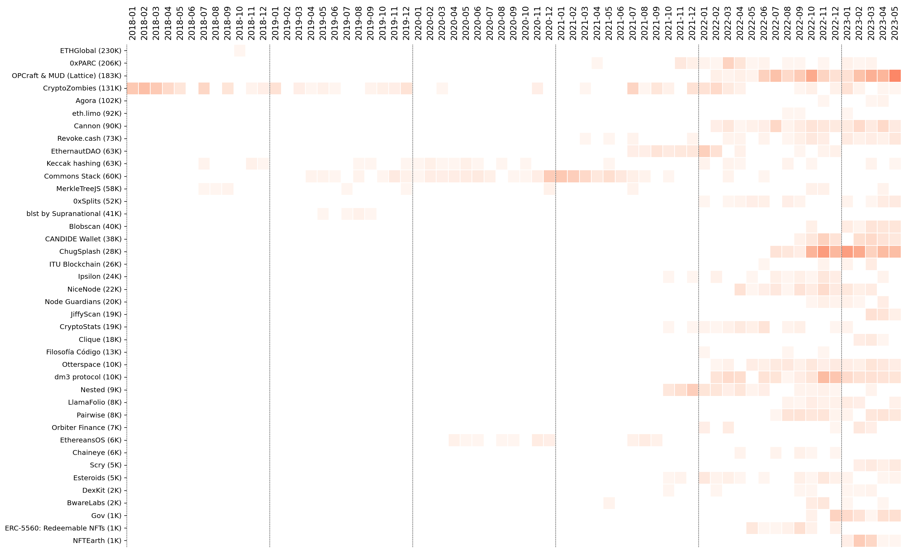

### Combining categories

We can also visualize different combinations of dimensions as treemaps. These are just screenshots – we have interactive versions as well. 

It’s worth noting that a number of personal projects received more funding than many of the organization-run projects – and more funding than some of the teams of teams projects like Remix and Support NERDs.

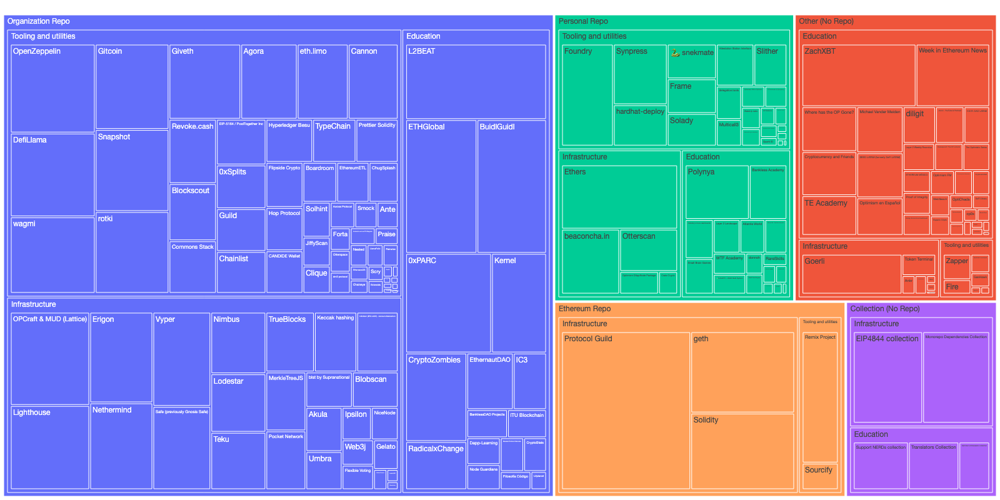

Unsurprisingly, long-standing projects with steady momentum tended to receive the highest grant sizes. Over time, it will be interesting to see how preferences change and if subsequent rounds start to favor younger, rising projects, or alternatively the oldest, most hardened projects.

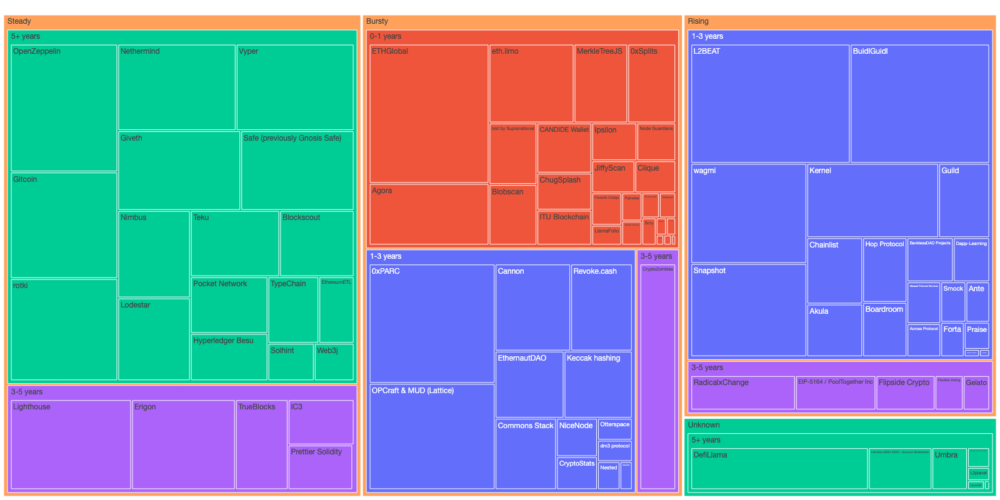

# Takeaways

We hope that this analysis hints at what becomes possible if projects provide structured data that facilitates permissionless observation. Optimism is in a position to create grant eligibility requirements that promote transparency and building in public across its entire ecosystem. 

GitHub and onchain activity are just the tip of the iceberg – and the metrics we happened to pull about RPGF2 projects’ GitHub and onchain activity are just the tip of *that* iceberg! 

To recap our recommendations for initial requirements:

1. Create precise **entity definitions**: e.g., individuals, organizations, collections.

2. Verify **eligibility requirements** for each entity-type during the application phase: e.g., an “organization” has a GitHub organization in its control.

3. Require entities to link at least one source of **public work artifacts**: e.g., a GitHub repo, a factory contract on OP mainnet, an RSS feed.

4. Require entities to share a **dedicated address** for receiving grant funds.

Ideally, all of these metrics can be tracked passively, simplifying the application process for projects. This would make it possible for funding rounds to happen continuously, e.g., projects are fundable as long as they remain active or until they opt-out. It’s also possible to create impact oracles that trigger funding when certain milestones are reached.

We view impact optimization as a reinforcement learning problem: badgeholders are the humans-in-the-loop giving feedback on algorithm selection, while the foundation has the ability to modulate all sorts of design parameters like funding pool size and frequency.

With better data, onchain results oracles, and the emergence of new forms of impact attestations, it’s possible to not only to improve the ROI of RetroPGF but to transform how digital public goods are funded. We came for the vibes and low gas fees, we’re only going to stay if the public goods are good.