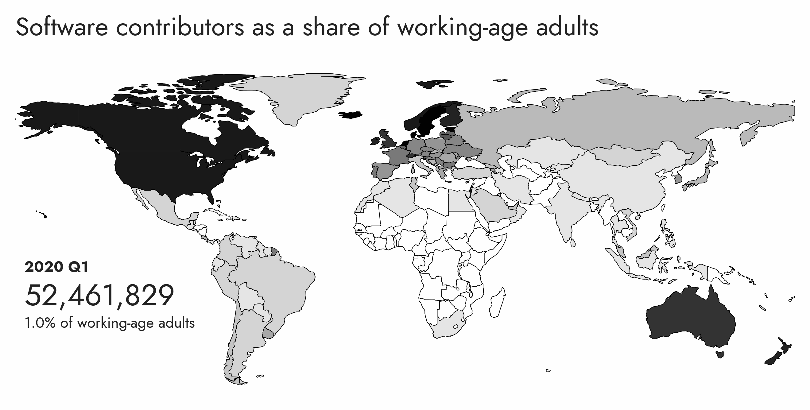
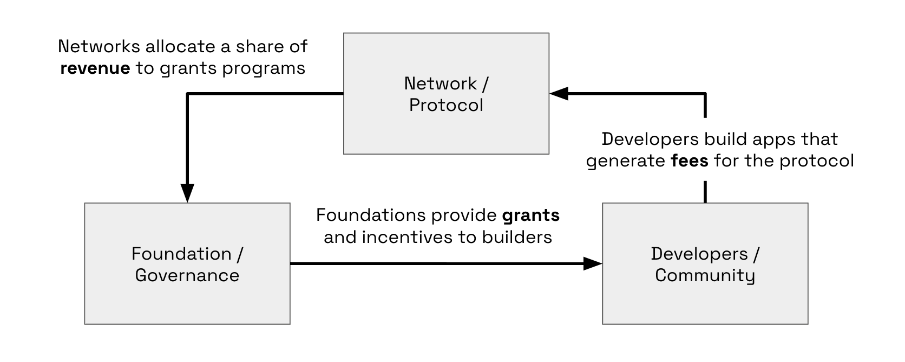
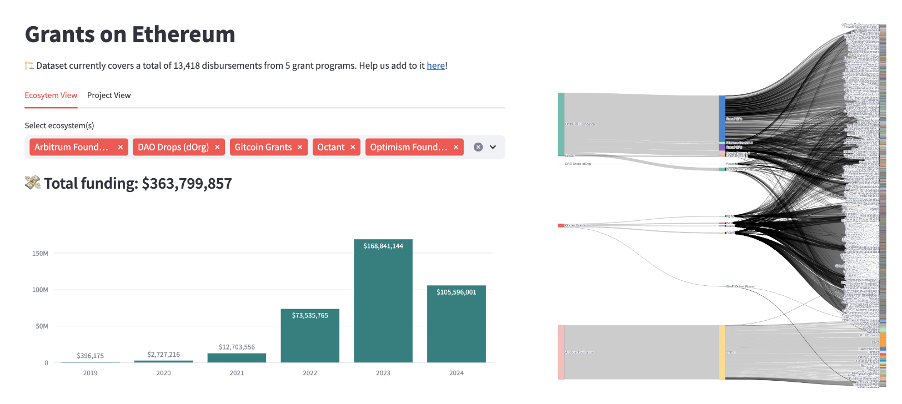
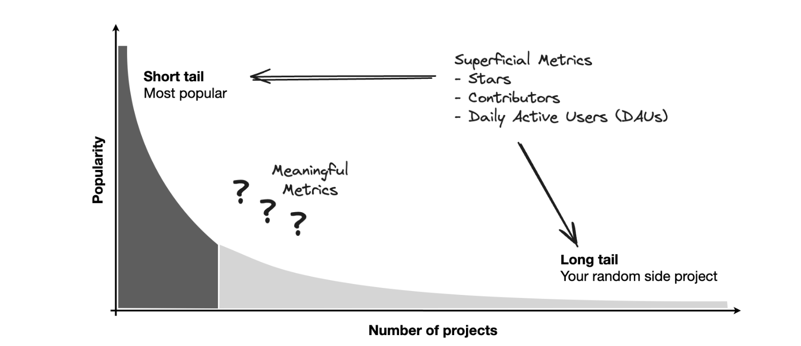
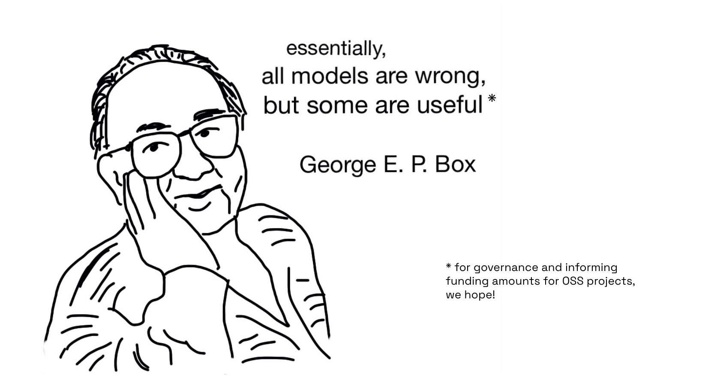
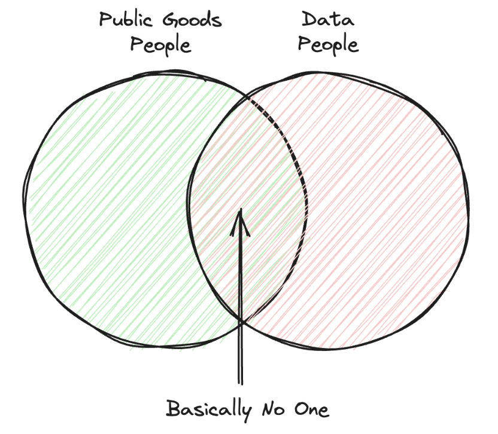

### Measuring the impact of open source software

*April 13, 2024*

> The following is a lightly-edited transcript from a talk I gave at [Funding the Commons](https://www.fundingthecommons.io/) in Berkeley, CA in April 2024. You can find the YouTube recording [here](https://youtu.be/rMIiGbxEAw8?feature=shared) as well as the complete original slides [here](https://docs.google.com/presentation/d/1gMRFlRe55W_GZmxat27vg9mP6kOWsNsCt0bwY_TUrlI/edit?usp=sharing). Note: the video is only a five minute excerpt from the talk. They basically cut out the middle section with all the data visualizations!

We’re here because we care about open source. Open source is a growing and incredibly important part of the world. Open source is borderless: the ways that we contribute are increasingly based on domain interest networks and not on locality or geography.

Crypto uniquely cares about funding open source, because everything that's written to a blockchain is supposed to be public and verifiable. For crypto networks, having a vibrant open source economy is not a nice-to-have or something people think about during ["20% time"](https://en.wikipedia.org/wiki/Side_project_time). It's a top priority.

Some networks, like [Optimism](https://optimism.io) for instance, are trying to create a flywheel around funding open source. Here's how this works. A share of the revenue generated from user activity on the network flows into a foundation. The foundation uses that income to provide funding to projects. Those projects then bring more value back to the network. These projects don’t need to have a fee because they can rely on this form of funding to cover their operations and grow.

This is the promise, of course. Right now, as in many things in crypto, you might say, "that's a beautiful idea, but it doesn’t exist in practice." The reality, though, is that this is happening. It's happening on a scale that surprised even me when I checked the numbers yesterday. 

There’s a site called [growthepie](https://growthepie.xyz) where you can see on a daily basis how much profit some of these networks are spinning off.

There are also hundreds of open source teams organized independently of the network itself. They decide how much time to focus on networks like Optimism, Arbitrum, or any other. Each of these networks has roughly a thousand or so active developers contributing regularly to a variety of open source initiatives.

Now let's look at the funding picture.

Once again, this is not just a beautiful concept, but there’s actual real funding flowing into these open source projects. The networks, naturally, want to fund the projects having the most impact. Even during a weak market, the amount of funding going into open source projects has been increasing pretty rapidly. Already in 2024, there's been more than $100M worth of funding allocated. We’re on track to exceed what was deployed in 2023.

The Sankey diagram above also shows that there are many projects, and in many cases, more than one foundation financing the same project. It could be Arbitrum and Optimism, or community-driven initiatives like Gitcoin and Octant, all funding the same project.

[The video skips over the deep dive into the data used to track developer and user activity, and measure projects' impact.]

There is a powerful opportunity to combine data about funding, work contributions, and network-level impact outcomes. In the same way that better visibility in financial markets has led to changes in funding allocation, we believe the same is possible for open source funding. By layering these data sets and indexing them so they are more accessible, we believe we can dramatically improve funding outcomes and the impact of open source networks.

There are definitely some challenges here. Superficial metrics like the number of stars, contributors, daily active users, etc., are probably good at identifying both the things on the extreme end of the short tail and the long tail.

The hard work, however, is in the middle: finding meaningful metrics to identify the projects that will become the big ones of the future or the keystone species in their ecosystem. What kind of signals can we use to identify those projects and develop good predictive metrics? Ideally, we want to use that to inform the funding decisions we make.

As George Box famously said, “All models are wrong, but some are useful.” There’s a lot of work required to search across the space and try out different models. 

Hopefully, through governance and designing experiments, we can find some models that are useful in governing and improving the efficacy of these grants programs.

The last part of my presentation covers some of the work that lies ahead.

The jobs we need right now involve both people who are excited about public goods like open source software and people who enjoy working with novel datasets. Unfortunately, today, there are very few people at the intersection of those two populations.

One of the things we care about is building a network of impact data scientists. These are people who care about impact and want to develop data skills to address how we fund more of the things that matter most. This work has the potential to change how we fund projects and ultimately change the world. We need a network of people who care about having that kind of impact. If that resonates, I would love to hear from you. Please reach out.