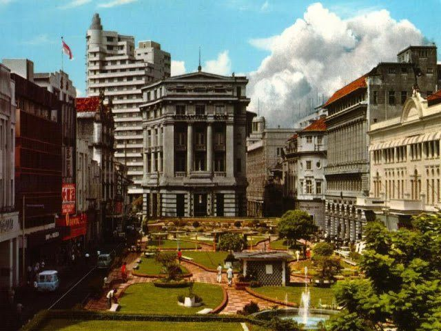

### The most interesting economic experiment you’ve never heard of

*January 23, 2024*

> Originally published on [Mirror](https://mirror.xyz/cerv1.eth/SupW7pL4YBK56YY3HOWhz_9aOeMiKUDsPG4xVZSBE6k). Archived here from Arweave (tx `W_zfFGJvCGUsqD_nGYNHeMFe9TRtK7QYeBgL_USxqec`).

In a small nation — I will tell you which one at the end of this essay — an intriguing economic experiment has been unfolding over the past few years.

With a sizable sovereign wealth fund and an expanding tax base, the nation has adopted an unconventional approach to public sector funding. Instead of the traditional budgeting process, they focus on **retroactive funding.**

Retroactive funding simply means funding work after it’s had some impact, not before. The idea is that it is much easier to look back and identify what is working than it is to look forward and predict what might work.

Indeed, the heart of this experiment lies in the nation's unique funding approach.

The government has a highly publicized and ceremonious process for looking back and determining which infrastructure and contributions have been most impactful to their nation. These projects then receive cash grants, no strings attached.

This system is open to any organization or individual, promoting a diverse range of contributions. It’s extremely easy to participate.

The social links among citizens are dense enough that groups of similar contributors are able to self-organize. There’s also a culture of openly addressing conflicts of interest between the people in government and the people applying for funding.

Another notable aspect of this experiment is the nation's efficient and transparent tax collection system. Anyone can see how the treasury is being replenished and who is paying for it. Although debates arise on the allocation of funds, the collection process itself is universally accepted.

The program began with a modest $1M retroactive funding pool. Then it grew to around $20M. Now, entering its third round, the nation is preparing to disburse roughly $50M next month and has even larger commitments earmarked for the 2024 fiscal year.

These figures may seem like a drop in the bucket in comparison to the budgets of bigger nations. However, the grants are meaningful to this nation’s economy and have garnered a lot of attention from regional trading partners.

But is it working?

It’s too soon to tell how this type of funding compares to traditional approaches. Like the mechanism itself, it will be easier to look back in a couple years and see what impact the program has had than to extrapolate from early signs.

That said, the best analysis of how it’s going is from the government’s own retrospectives of its retroactive funding rounds. After each cycle, results are discussed publicly and analyzed with citizens. The government shares the data on who made what impact claim and how much they were ultimately compensated for it. There is also a growing community of researchers pouring over the data and citizen journalists reporting on the whole process. Feedback is fed into the next round. Each round is therefore not only getting bigger but more sophisticated.

Organizations that received significant lump sums from past rounds say the experiment is changing the economics of working for the public sector. This new form of funding is starting to feel like recurring revenue. They are reorienting their work in anticipation of retroactive support.

The experiment also appears to be attracting immigrants. The nation has coupled its unique “impact meritocracy” with a highly permissive immigration policy. Like Florence was for painters, and Silicon Valley for hackers, it’s becoming an innovation hub. The government explicitly wants to create a fly trap for people motivated to re-imagine and contribute to the public sector.

“Move here so you can contribute to our public sector” isn’t a call to adventure you hear very often. But it might as well be this government’s party line.

---

So, what is this experiment and where is it happening?

“It’s not capitalism, it’s not communism, it’s Optimism.”

That’s the name of this nation: Optimism.

It’s a decentralized network economy running on top of the Ethereum blockchain. They’ve created their own digital currency, bicameral governance, and economic engine. There are over 100,000 citizens and a GDP, so to speak, of [over $3 billion](https://l2beat.com/scaling/projects/optimism) at the time of writing.

The name “Optimism” is not just a hope that all this will work out and lead to a better future but also a nod to the “optimistic roll-up” technology and game theory underpinning the whole system.

Winston Churchill famously said, “democracy is the worst form of government — except for all the others that have been tried.”

You can roll your eyes and identify a thousand reasons not to be optimistic about this experiment. But who else is trying? What other interesting economic experiments of this scale and complexity are underway right now?

A nation is forming that hopes its biggest export will be a new model for funding public infrastructure and services. Even if you have no intention of ever visiting this strange corner of the internet, you should know about it.

