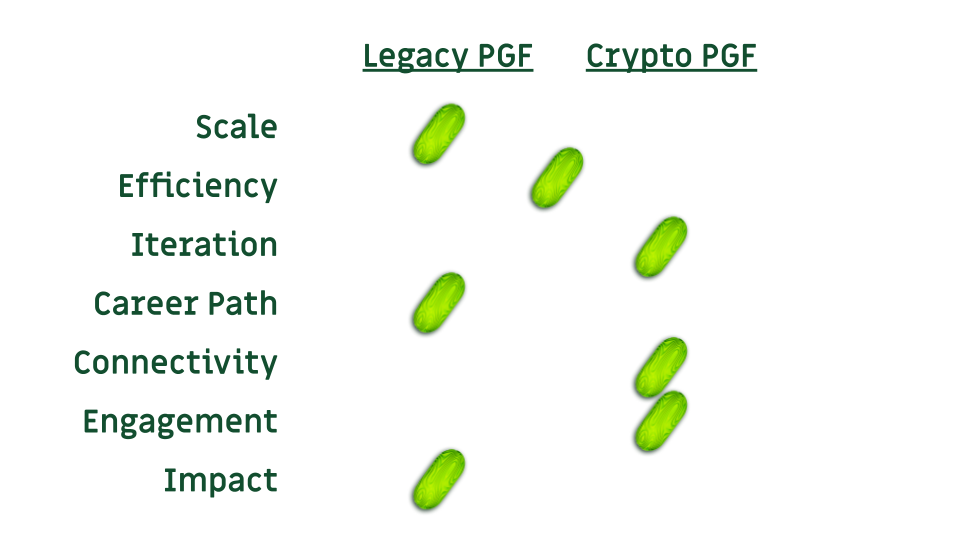

### The Past, Present and Future of Public Goods Funding

*November 17, 2023*

> Originally published on [Mirror](https://mirror.xyz/cerv1.eth/VfD17ebuKnUr3jXI2Bbw0qvH1GbsCO6NqjqQ0ecJW_c). Archived here from the [Arweave transaction](https://viewblock.io/arweave/tx/nnXFtiIVApNPYzcXC-MFmw5dkEZwj3d8WYTw0H4iRfQ).

*Here’s a talk I gave at the Greenpill NYC series on September 23, 2023. Two months after the event, I turned my notes from the talk into this blog post. I’m not aware of a recording of what I actually said but hopefully this is close enough. Great appreciation to Luciano, Tirisanna, Mathilda, Scott, Izzy, Owocki and others I’m not naming for making this event happen, and to the several dozen people who showed up in BedStuy on a rainy Saturday on the heels of NY Climate Week and Mainnet to take the green pill.*

We’re here because we are optimistic about the future of public goods funding and want to see the space evolve from crypto funding its own public goods to crypto being foundational infrastructure for funding all sorts of digital and real world public goods.

To get there, we need to speed run all the lessons learned by legacy institutions when it comes to public goods funding. This is still a young, fringe movement, but there are some genuine tailwinds behind us.

In preparing for this talk, I created a 7-point scorecard to rate the state of crypto public goods funding vs legacy systems. It’s neither scientific nor exhaustive, but I hope it offers some inspiration for where to go and clues for how to get there.

## Scale

Spoiler alert: the size of the crypto space for public goods funding is tiny.

Before talking numbers, let me define the space I’m referring to more precisely. I’m talking about decentralized public goods funding on crypto rails. I’m not talking about more traditional foundation grants or VC-style funding, which still have centralized coordination mechanisms and disburse funds on legacy rails.

The Ethereum PGF ecosystem includes players like the Ethereum Foundation, Protocol Labs, Gitcoin, Giveth, clr.fund, Optimism RetroPGF, Protocol Guild, DAO Drops, Arbitrum DAO, Octant, Celo, Uniswap, Starknet, Polygon, and various others. Collectively, these players allocate approximately $100 million annually to public goods.

Now let’s put this figure into perspective.

A hundred million is less than the budget allocated for public goods in Samoa. Samoa, if you’re not familiar, is an island nation in the Pacific Ocean with a population of around 200,000. It’s the smallest public sector budget that I could find data on [here](https://www.theglobaleconomy.com/rankings/government_spending_dollars/).

Getting to $500 million would put us on the same level as Chad. The point is we have a long way to go if we want to make waves relative to traditional public goods funding.

Early in my career, I worked for an international development NGO. We received a $50 million grant from the Gates Foundation and my team grew to employ hundreds of people. At that organization, we didn’t really get out of bed for grants of less than $1 million. It was a completely different scale.

Right now, no one in crypto is getting grants for over $1 million. A few of the top projects on Optimism RPGF have gotten grants over $200K. The top projects on Gitcoin these days may earn $30K per round.

Specifically in the case of Gitcoin, we’re talking about a matching pool of $1M divided across several hundred projects. We’re orders of magnitude smaller than the most discretionary segments of traditional public goods funding like international development. We don’t even register in comparison to the big fish like health care, education, and infrastructure.

We’re a rounding error and it’s OK. We’re the underdogs. To crossover, we need to grow this movement to nation state scale: billions and eventually tens of billions in decentralized public goods funding.

**Crypto PGF 0, Legacy PGF 1**

## Efficiency

This one is more of a mixed bag.

Everyone is familiar with the fundraising problem. Fundraising is hard. All the time you spend fundraising is time you are not spending doing good work. It’s also expensive.

My first job back in high school was canvassing for an environmental activist group. We’d get paid something like $8/hour and had a target of raising $120/night. Anything you raised above $120, you kept 50% of it. I had a few nights where I raised over $300 and a lot of nights where I came back with less than $100. So the cost of fundraising at that org was basically 50%. What did they do with the surplus money? It would go towards lobbying and media campaigns, which also had their own overheads. So for every $1 raised, probably less than 10 cents went towards the intended mission.

This is actually pretty typical.

There’s an organization called Charity Navigator that rates the efficiency of different nonprofits based on the ratio of their fundraising costs to the program costs. The problem is that most nonprofits have worked out how to manipulate the formula by categorizing people like me, the door-knockers, as a part of program costs.

There are exceptions. Give Directly, for example, give money directly to poor people with no strings attached and rigorously track their efficiency and impact.

There are some parts of the crypto public goods funding cycle that are very efficient. I absolutely love how I can go on Gitcoin grants and fund 50 projects all over the world in minutes. But I’ve also been on the other side of the table as a recipient. You need to be popular in order to perform well in quadratic funding  – and that takes a fair amount of time. There’s also all the issues around fiat on/off ramps and L2 bridging. Plus tax stuff if you’re here in the US.

So I’m going to call this a draw and assign a half point to each side.

**Crypto PGF 0.5, Legacy PGF 1.5**

In the future, I think crypto has to win this battle hands down. I hope projects like tea.xyz and drips v2 get widely adopted because they have potential to make getting paid extremely efficient. And I hope these models permeate beyond open source software.

## Iteration

There’s really not much incentive to iterate rapidly in the legacy public goods space. It’s quite rare. And there are a lot of things that still happen that everyone recognizes is bad or ineffective but no one can change. That’s the definition of coordination failure.

David Deutsch has this saying that “preserving the means of error correction is the heart of morality”. In other words, a well-designed system is one that is always open to criticism and looking to improve itself. A poorly designed or in his words “immoral system” is one that continues to operate in failure mode.

I think crypto has a real advantage here. There’s just so much experimentation happening.

I also think there’s something compelling about protocols ossifying and iterating less as they become more widely adopted. The cost of maintenance decays. In the legacy world, as something becomes more widely adopted, the bureaucracy to sustain it grows more complex. It compounds at 5% year over year.

My hope for the future of crypto public goods funding is that you have a lot of experimentation at the edges and then a series of hardened protocols at the center which have minimal or no governance. This is exactly the opposite of legacy systems, where there’s very little funding at the periphery and most of the funding remains at the center and goes towards sustaining an ossified structure.

One point for crypto on this one.

**Crypto PGF 1.5, Legacy PGF 1.5**

## Career path

The good and the bad thing about legacy public goods funding is that there’s a real career path in it. In fact, legacy public sector jobs probably offer the most predictable career path one can imagine these days. This is true for civil servants and teachers. It’s also true for international aid workers and employees of large nonprofits.

I lived in East Africa for a while and I knew people who were trying to get into the United Nations system. Once you got in, you’d effectively have your housing and living costs paid for for life, you’d earn a tax free salary, and you’d never have to wait in the passport lines anywhere you traveled. It was hard to get in, but once you were in, you were effectively set for life.

I love the meme of the “quadratic freelancer” - an open source contributor who lives off Gitcoin grants - but I don’t think it’s a lifestyle that everyone wants.

A quick tangent and then I’ll return to this point…

The first thing I did out of college was set up a microfinance bank in a rural part of Tanzania. We would give out uncollateralized loans of around $100 for people to start small-scale businesses – like running a vegetable stand or repairing bike tires. It worked, and most people repaid their loans, but there was a critical flaw in our logic. We assumed everyone wanted to be a small scale entrepreneur. The reality is that most of the so-called micro entrepreneurs we were lending to would have happily traded their vegetable stand or bike shop for a job in a factory.

You know the saying “sell the hole, not the drill”. Most people just wanted to make a stable living, not be entrepreneurs.

The same is probably true over here. I think a lot of people just want what this:

<https://twitter.com/dabit3/status/1695040015108133266>

I hope the future means that there is not only more public goods funding available but also more business models and therefore job opportunities at organizations or DAOs or guilds or whatevers to survive and prosper on public goods funding.

I know that goal was at the heart of Gitcoin’s origin story and hopefully unites all of us in this room. If crypto can enable a range of fulfilling career paths in the public goodsy space, from being a quadratic freelancer to an Allo round manager to a local Greenpill chapter organizer to an enterprise scale hypercert selling beach cleaning service, then that would be good.

Right now though, it’s precarious. So I have to hand this one to legacy PGF.

**Crypto PGF 1.5, Legacy PGF 2.5**

## Connectivity

Of all the things discussed so far, this is actually the criterion that I think will be most important in the long run and where crypto has the biggest advantage.

Traditional nonprofits and public sector organizations are highly territorial. It’s so zero sum and myopic despite the rhetoric of being in service of the public good.

Can you imagine a world where, say, a Brooklyn school proudly announced that they were forking an idea from a Boulder school? Look at cannabis regulations. Every state is literally coming up with its own slightly different variation. Where’s the pride in saying “we cloned this from Colorado” or “we took these parts from California but this one from Massachusetts”.

It’s even worse in the nonprofit sector. How often do universities collaborate on research? Do donor governments co-fund a road or school? Do NGOs partner on a training program? It’s exceedingly rare.

Sadly, there is a pervasive scarcity mindset at least in the parts of the public sector I’ve experienced.

Crypto feels different. Sure, we have other forms of tribalism like Bitcoin maximalism, EVM supremacists, etc. But within ecosystems of values aligned people, the connectivity and interdependence is something truly special.

This connectivity is more than vibes. (A lot of it is vibes though, which is fine.) You can see it in network graphs of Twitter followers and Github contributions. People literally depend on each other and promote each other.

This is probably the thing I love most about Gitcoin’s community. Even though there’s only a limited matching pool, everybody is supporting each other and trying to grow the pie. It’s extraordinary and a breath of fresh air.

Why is this the case?

I think it’s at least partly because crypto still feels like a David vs Goliath type endeavor, and WAGMI is a powerful drug. But I think it’s also because so much of crypto is open source and has to be open source in order to plug in properly. This effectively enshrines connectivity and interdependence as a foundational properties of the crypto economy, in the same way that limited liability and bankruptcy protection enshrine risk-taking as a foundational property of the real world economy.

I think in the long run this is going to be crypto public goods funding’s greatest lesson for the rest of the world. Sure, there’s still plenty of politicking, infighting, FUDing, etc at the day-to-day social layer, but crypto value chains are much more circular and intertwined than legacy ones. It’s like the Flatland parable, trying to explain three dimensions to a world that has only conceived of two.

Anyway, one very big point for crypto on this one and I hope it only continues in this direction.

**Crypto PGF 2.5, Legacy PGF 2.5**

## Engagement

This is a semi-related point, but let’s just acknowledge that funding web3 public goods is much more fun. I look forward to Gitcoin Grants rounds. I love learning about new projects and novel funding mechanisms. Maybe it’s just because we’re a bunch of nerds, but I think the fun and social aspect of this is really important.

When you think about it, sharing the public goods you care about is one of the most important and meaningful ways of asserting your personality and social influence.

Compare this to the cynicism that you see in the traditional public goods space. Cynicism is putting it lightly.

My grandmother used to say that she loved paying taxes because of all the good things they funded. Can you imagine anyone saying that in 2023?

Last November, I voted here in the New York primaries, and one of the ballots I was presented with was for the state supreme court. There were twelve positions up for election and twelve people running. In addition, each person running was able to identify with any number of parties. So most candidates chose to appeal to multiple parties: Democrats, Republicans, Libertarians, Working Families, and probably a few others. All in all, it was a matrix of 12 rows representing the people and 6 columns representing the parties they represented. I stared at it for 5 minutes thinking I was missing something. There were 12 candidates. Running for 12 spots. And each candidate was able to identify with as many parties as they wanted. So, no matter how I colored in the ballot, the outcome would be exactly the same. What the f is going on.

Thank you for the “I ✔️oted” sticker but I’d actually prefer a POAP.

Anyone, one point goes to crypto public goods on this one.

**Crypto PGF 3.5, Legacy PGF 2.5**

## Impact

Let’s recap. We’re at 3 for crypto, 2 for legacy, and 1 draw. The last one is impact.

Impact is the reason we’re all here, I think. We want to fund what matters. Well, what matters to you? And are you achieving it?

It’s complicated. In my case, I usually fund a range of projects on Gitcoin. Some I benefit from directly and really want to continue. Some I don’t benefit from at all directly but want to support the teams.

Let me rephrase this slightly. There are some projects that are good for now me. There are some that I believe are good for future me. And there are also some that really have no impact on now or future me but I appreciate the team and want to support anyway.

Unfortunately, all of this nuance is lost when I give each of them 5 dollars. It also reveals some of the disconnect between a relatively close-knit community deciding which public goods are most impactful and me asserting some preferences on other communities based on vibes or perception.

I don’t think the second case is wrong, but I don’t think it’s as impactful as the first one. In the first case, as a beneficiary, I’m happy to vote directly. In the second case, I care about the overall impact domain, but don’t really have an opinion that should be weighted more than people who are actively impacted by the work.

So I think we need to work on this. There’s something incredibly impactful about a community deciding which public goods it values most. But I don’t think we’ve struck the right balance of that happening in all the rounds.

In addition to getting the right voices elevated, we also need data.

Right now it’s mostly anecdotal. There’s a couple ways to fix this. One is to get the data to prove it and start measuring impact ROI. This is a problem I’m personally passionate about and am going to be focusing on. Another is to build up the primitives we use to account for impact. This is where hypercerts come into play.

The end state though is that you have credibly neutral ways of measuring and evaluating impact. Balaji refers to this as the ledger of record or a model of cryptoinformation.

Contrast this with the current state, where you either have organizations marking their own homework or strong perverse incentives to say everything is going just great.

This is where I think crypto has the great potential to eclipse the legacy model, but little to show for it today. If I had to vote, I’d give my vote to legacy systems having more impact than crypto public goods funding.

Of course, this has to change, and that’s why we’re here. That’s why we show up. To events like this. To every Gitcoin round. Because this is a movement.

I’ll end with one last story. A few months ago, one of those environmental activists knocked on my door. Now these groups have data to track who regularly gives them money; I’m one of those people, so they make sure to come to my apartment each year. I listened to the whole spiel. Honestly, it wasn’t very persuasive. The CTA is always the same: we did great things with your donation last year, but this year there’s something even more important so you need to give us 2x more.

Anyway, I cut her a check (yeah, one of those paper things) and as I handed it to her I asked if she’d heard of something called “quadratic funding”. She had! She knew about Gitcoin too! She even said she’d tried doing some DAO stuff!

I went back inside and gave her my copy of the Greenpill book – and a photocopy of an essay I wrote back in high school and published in my local newspaper about being a door-to-door activist just like her.

There was a part of me that hoped she’d be in this room today. Maybe at the next one.

I hope this movement grows. It’s fun being the Gen X speaker sharing stories about how bad the legacy system is, but I look forward to a day when the scorecard is a unanimous 7-0 and it feels quaint that there was ever a time when this was in doubt.

Public goods are good.