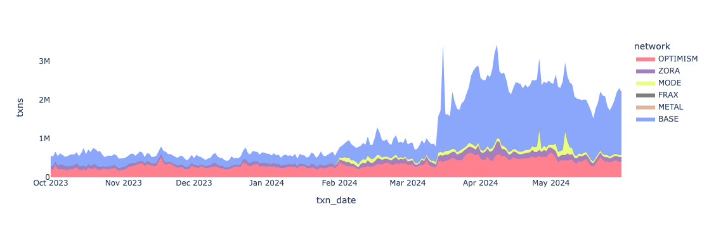
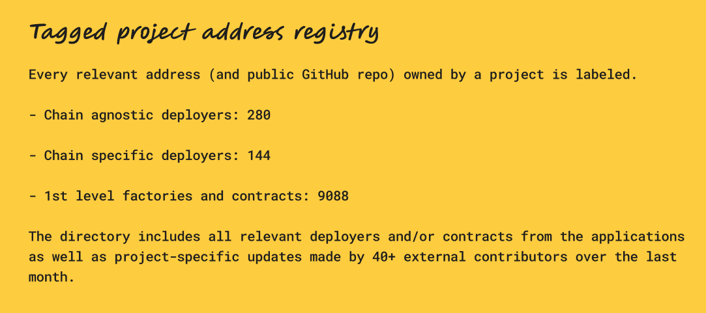
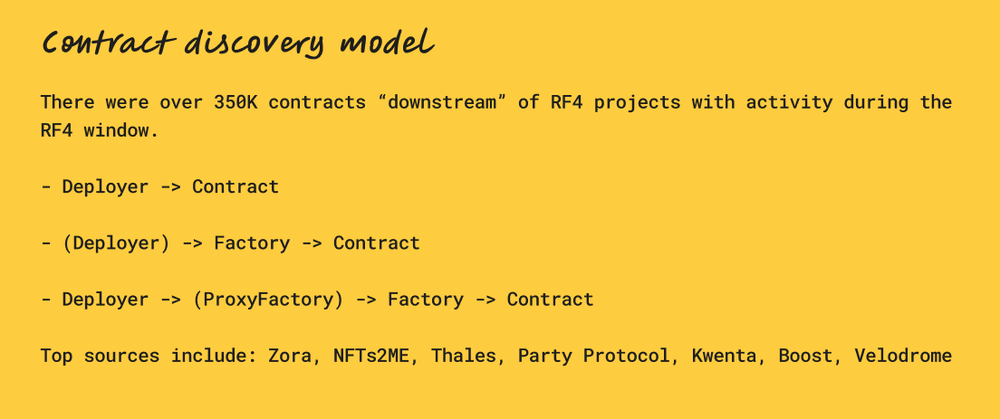
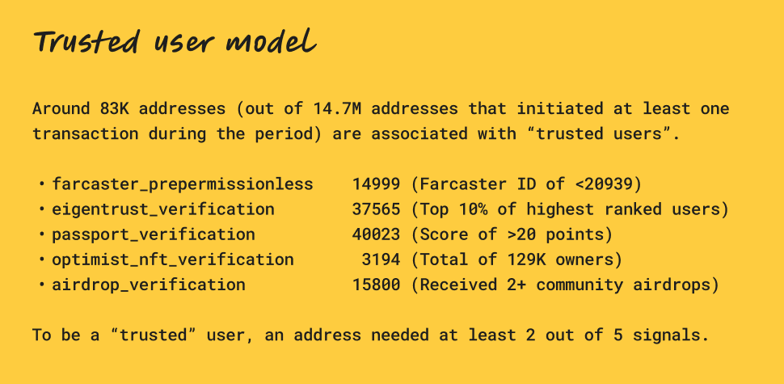
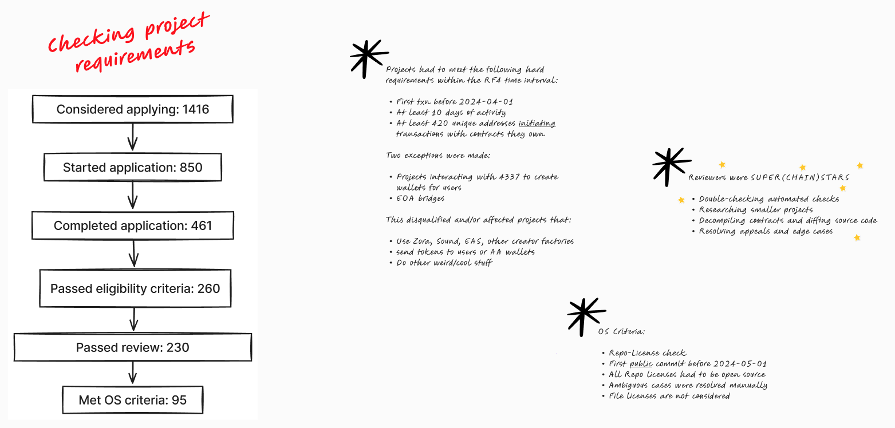
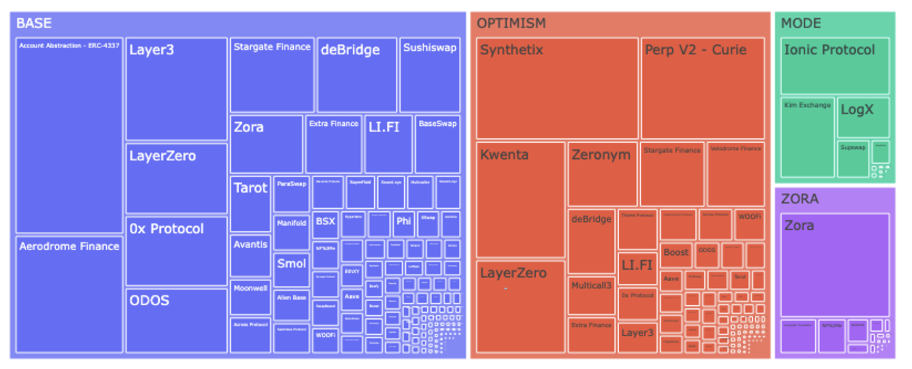
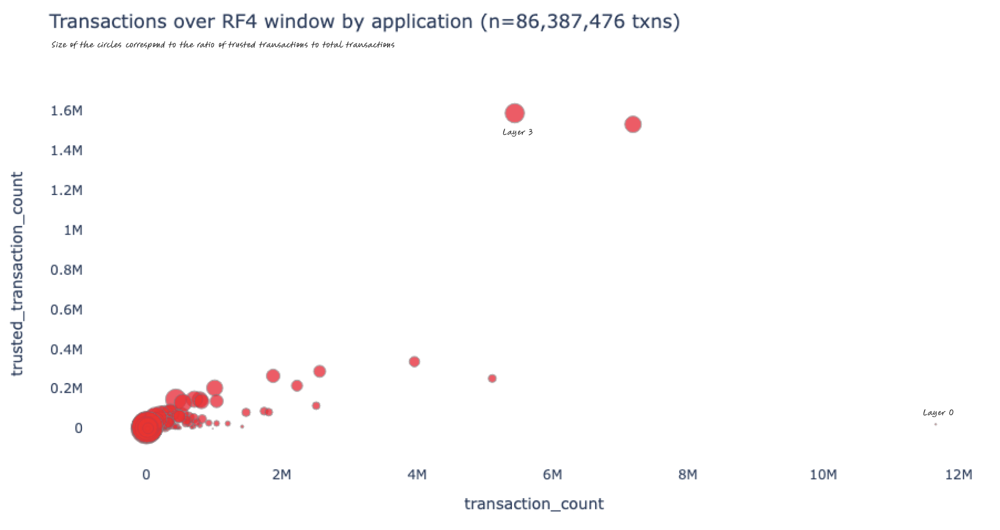
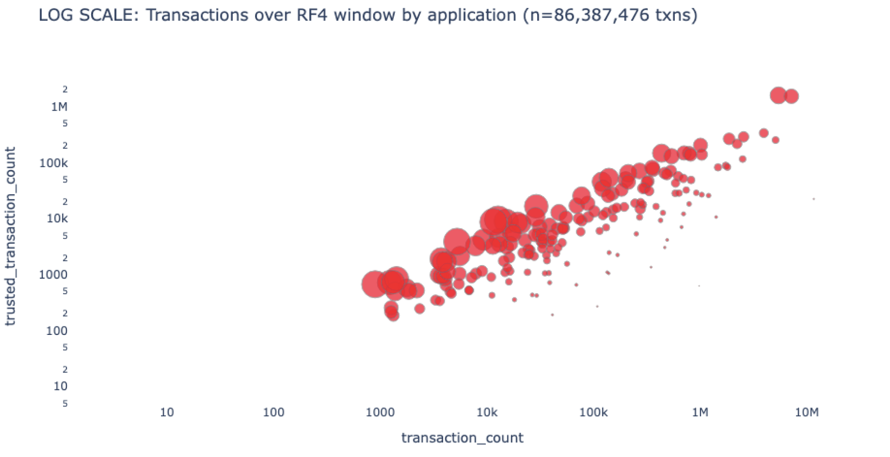
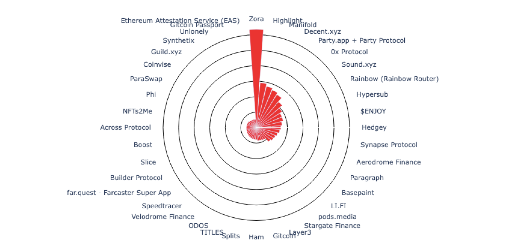

### A deep dive on impact metrics for Retro Funding 4

*June 28, 2024*

> Originally published on [Mirror](https://mirror.xyz/cerv1.eth/0s05D8YqJwezhJpOn9PEx_jLihvTqtFxw0R4_6nFl5I). Archived here from Arweave (tx `uY5fedN6PescUgE8kcHMvH32Iu9BFe3qnherSJuX_SM`).

Voting for Optimism’s fourth round of Retroactive Public Goods Funding (“Retro Funding”) just started. You can check it out [here](https://round4.optimism.io/welcome).

Last round, voters were tasked with comparing the contributions of more than 500 projects, from underlying infrastructure like [Geth](https://github.com/ethereum/go-ethereum) to pop-up cities like [Zuzalu](https://www.zuzalu.city/), and then constructing a ballot that assigned a specific OP reward to each project based on its perceived impact.

This round, voters will be comparing just 16 impact metrics – and using their ballots to construct a weighting function that can be applied consistently to the roughly 200 projects in the round. The long-tail has also been truncated by applying a series of programmatic eligibility checks, removing 200+ projects from voting contention.

This post serves mainly as a brain dump on the work our three person team at Open Source Observer did over the past few months to help organize data about projects and prepare Optimism badgeholders for voting.

Here’s what’s included:

* General reflections

* Where the metrics come from

* Critical design choices

* How the metrics evolved

* FAQs

## General reflections

We finalized the metrics at 18:00 UTC on 2024-06-26. Getting to that point was a tremendous lift – the result of many, many contributors beyond the OSO team.

We’re grateful to the teams at Agora, Gitcoin/West, and CharmVerse who worked closely with the Optimism Foundation to build the voting, sign-up, and review platforms; to our data partners including GoldSky, Passport, and Karma3, who provided foundational datasets as a public good; to the OP Labs data team who helped us build good models on top of all that data (and never tired of our ELI5 questions); to Simona Pop for facilitating discussions about the metrics and to the numerous badgeholders who participated and provided thoughtful feedback throughout the design process; to the reviewers who rose to the challenge of enforcing eligibility criteria and resolving every last edge case; and to the onchain builders who showed up, often in pull requests (and sometimes in my DMs too), to help us correctly catalog their work artifacts. Thank you.

I was searching for an eloquent way of describing this whole process, and came across [this quote](https://gov.optimism.io/t/ratification-of-profit-definition-for-round-4/8312/34?u=ccerv1) from Jesse Pollak on the gov forum earlier this week. Although he was referring to the *profit* side of the “impact = profit” equation, I think it applies just as well to the *impact* side:

> “This is the hard work of incrementally building new governance systems that work better than anything our world has seen before.”

Regardless of how the round plays out, RF4 will have accomplished at least one great thing: it will have elevated the debate to what forms of impact matter most, where that impact can be observed, and who deserves to claim it.

This is what governance is all about.

The models that we shipped for RF4 are by no means perfect but we do think they are useful. They are a step forward towards creating a more level playing field and giving voters a more direct mechanism to vote their values.

For instance, there has been a lot of debate over these last 6 months about the impact of meme coins and whether they are good or bad for crypto adoption. In RF4, we have both meme coins and foundational protocols in the same arena. Now we can critically compare which ones attract and retain more users, generate more blockspace demand, are most used by Optimism badgeholders, and so on. This is the potential of metrics-based voting. 

But there will also be lots to criticize and learn from.

If the metrics are correct, no one will say anything. If there is something off or missing from the data, people will speak up. It’s nerve-wracking being close to the process, but as Jesse said this is how we incrementally build better systems.

Zooming out, the true test is not whether the metrics attain 99% accuracy but whether this experiment gets Optimism closer to optimal retro funding. Although we won’t have the ability to compare the allocations we get from RF4 against what would have happened in a round that was run the same way as RF3, or that had 1500 projects in it, we will be able to compare the performance of different portfolios of projects over time. We can compare the projects that were accepted into the round to the ones that weren’t – and to the ones that didn’t apply. We can analyze the impact of deploying funding against specific metrics.

One of the most important jobs for governance is to continuously critique and tweak the grants flywheel over each successive round, bringing the collective closer to optimal allocation.

Now let’s get into the data.

## Where the metrics come from

At Open Source Observer, we built a first-of-its-kind data pipeline for the Superchain: not only the data but also all source code, query logic, and underlying infrastructure is publicly available for use. We aren’t aware of any other fully open data pipelines of this size or complexity built this way.

You can check out the docs for how to get or build on top of the data [here](https://docs.opensource.observer/docs/integrate/). We also published a companion [blog post](https://docs.opensource.observer/blog/impact-metrics-rf4#data-model) last month that explains each of the impact metrics in detail.

In the case of RF4, there are four key sources of data:

* Unified events model for the Superchain

* Tagged project address registry

* Contract discovery and attribution graph

* Trusted user model

### A Unified events model for the Superchain

There previously didn’t exist a unified transaction + trace model for the Superchain. Dune, for example, [currently](https://docs.dune.com/data-catalog/overview#evm-chains) includes Base, Optimism mainnet, and Zora chains – but not Frax, Metal, or Mode.

With data generously provided by GoldSky, Open Source Observer built a unified Superchain event model which anyone [can access directly](https://docs.opensource.observer/docs/integrate/) and do whatever they want with. Although the model contains all Superchain transactions and traces, it does not have logs in it (yet).

A unified events model means you can write a query like this:

```
select *
from `opensource-observer.oso.int_events`
where
 event_source in (‘BASE’, ‘OPTIMISM’, ‘FRAX’, ‘METAL’, ‘MODE’, ZORA’)
 and event_type = ‘CONTRACT_INVOCATION_DAILY_COUNT’
```

And generate a graph that looks like this:



You can also do the same thing for GitHub and other types of events.

```
select *
from `opensource-observer.oso.int_events`
where 
 event_source = ‘GITHUB’
 and event_type = ‘PULL_REQUEST_MERGED’    
```

We quietly released our unified events model last month and already have a number of teams building on top of it. As new OP stack chains come online, this unified events model should prove even more helpful.

### Tagged project address registry

Another foundational building block is a registry we maintain called [OSS Directory](https://github.com/opensource-observer/oss-directory). It is a public repository of projects and their associated GitHub repos, NPM packages, deployers, contracts, and other open source artifacts, with a strict schema and validation logic to ensure consistency.

Every project that applied for Retro Funding (and met eligibility criteria) is included in [OSS Directory](https://github.com/opensource-observer/oss-directory).



OSS Directory has one strict rule: an artifact can only belong to one project at a time. This means that a blockchain address or a repo cannot be included in multiple projects. I won’t get into all the nuances here, but there was considerable work mapping every relevant artifact to the appropriate project and resolving collisions. Many projects also made their own updates via pull request.

You can get the data by cloning the repo, API, NPM or Python libraries.

### Contract discovery model

In the first version of OSS Directory, we enumerated every contract deployment as well as the root deployer, if it was owned by the same project. This quickly became unwieldy and impractical to maintain, as new contracts are being deployed all the time.

While we still maintain the legacy artifacts that were added in this way, we’ve moved to a more scalable method of contract discovery. If a project owns its deployer and gives it the `any_evm` tag, then we monitor every EVM chain for deployments from that address. If a project deploys a factory, then we also associate every contract deployed by that factory with the project that owns the factory. Chain-specific deployers or factories can also be enumerated in a similar fashion, and we discovered everything downstream from them on just that chain.



There are several notable exceptions, for instance, contracts deployed using a `create2` factory are not credited to the deployer of the `create2` contract.

In general though, a project owns everything downstream of its artifacts in OSS Directory. Thus, from the 2240 contracts that were verified through the RF4 sign-up process, we “discovered” 376,000 downstream contracts. These include everything from smart contract wallets created by Biconomy and Daimo, to NFTs minted on platforms like Zora and Sound, to perps on Kwenta and pairs on Aerodrome.

You can see all of the discovered contracts [here](https://github.com/opensource-observer/insights/tree/main/analysis/optimism/retrofunding4/data).

### Trusted user model

A "trusted user" represents an address linked to an account that meets a certain threshold of reputation.

This metric aggregates reputation data from multiple platforms ([Farcaster](https://docs.farcaster.xyz/learn/architecture/hubs), [Passport](https://www.passport.xyz/), [EigenTrust by Karma3Labs](https://docs.karma3labs.com/eigentrust)), the [Optimist NFT collection](https://app.optimism.io/optimist-nft), and the OP Labs data team.

In order to be consider a trusted user, an address had to meet at least two of the following requirements as of 2024-05-21:

* Have a Farcaster ID of 20939

* Have a Passport score of 20 points or higher

* Have a Karma3Labs EigenTrust GlobalRank in the top 42,000 of Farcaster users

* Hold an Optimist NFT in their wallet

* Qualify for at least two (out of four) Optimism airdrops.



A total of 83K addresses met these requirements. A complete list is available as a CSV file [here](https://github.com/opensource-observer/insights/blob/main/analysis/optimism/retrofunding4/data/op_rf4_trusted_addresses.csv).

## Critical design choices

### Principles

The following design principles guided the development and evolution of impact metrics.

* Verifiability: Metrics should be based on public data that can be independently verified. They should not rely on proprietary data sources or private APIs.

* Reproducibility: Metrics should be easy to reproduce, simulate, and audit to ensure they are achieving the intended results. They should not have a "black box" element that makes them difficult to understand or replicate.

* Consistency: Metrics should be consistent across projects and artifacts. They should be calculated using the same methodology and data sources to ensure that they are comparable.

* Completeness: Metrics should be comprehensive and cover all projects and artifacts in the OSO database that fulfill basic requirements. They should not be highly sector-specific (eg, only relevant to Defi or NFT projects)

* Simplicity: Metrics should have business logic that is easy to understand. They should not require a deep understanding of the underlying data or complex statistical methods to interpret.

Given limited time and bandwidth, it was impossible to implement and test every good idea we received. We also set an explicit goal at the start of the round of choosing the best 15-20 metrics.

### Eligibility requirements

The round had very explicit eligibility criteria as well as impact attribution rules. They were determined at the start of the process by the Foundation, turned into automatic checks that we ran when projects applied, and vetted closely by the team of badgeholder reviewers.



To be eligible for RF4, a project had to:

* Deploy its own contracts on the Superchain (not via another project’s factory)

* Have its first transaction on the Superchain before 2024-04-01

* Have at least 10 days of onchain activity

* Have at least 420 unique addresses *initiating* transactions with contracts they own

All of these checks were applied to a tight time interval of 2024-01-01 to 2024-05-01. There were over 200 projects that applied and did not meet these requirements.

Some of the most common reasons for otherwise strong projects failing to meet eligibility criteria included:

* They were initiating transactions on behalf of users (eg, the user was the `to` address in the transaction)

* They were using factory contracts deployed by other projects (eg, minting platforms like Zora or Sound)

* They work by enabling their users to deploy their own contracts without interacting with a factory (eg, JokeRace)

* They were built on primitives that made it impossible to trace user interactions with the data available for the round or without employing some form of project- or use case-specific analysis on top of that data (eg, interactions via Farcaster frames or certain types of account abstraction projects)

Leveraging impact metrics requires the round to have a standardized model for measuring and attributing impact. Many of the above cases are from highly impactful projects that unfortunately were not a good fit for the specific requirements of this round. These cases were examined very closely by OSO and the review team, and many provide lessons for future rounds.

### Special cases, including 4337-related transactions

There were two exceptions made to the business logic above.

Projects interacting with the 4337 EntryPoint contracts were given credit for transactions and smart contract wallet addresses that were directly linked to contracts they owned, although the gas associated with such interactions was still attributed to the team that deployed the 4337s contracts. This (positively) affected metrics for a handful of account abstraction projects, including Beam, Biconomy, and Daimo. Unfortunately, projects that were one step further along the value chain, ie, that interacted with popular account abstraction operators like Biconomy and Pimlico, were not captured by the metrics.

Account abstraction is an extremely important growth vector for the Superchain. However, we can only reward what we can measure and verify. We need better data standards and public datasets for 4337 related contributions. These learnings should be taken to heart and hopefully improved upon in future rounds.

The other exception was for transactions made to EOA bridges. These were treated like interactions with a standard contract.

### Open source licensing

Another key design choice was the “open source software multiplier”. In badgeholder surveys, there was a strong desire to reward projects that are open source and permissively licensed. As result, an `is_oss` criterion was created for projects through a combination of automated checks and manual review by the Foundation.

The receive an open source badge, projects had to:

* Include the relevant GitHub repo(s) that contain their source code in their application;

* Have licenses that meet the requirements of the [Open Source Initiative](https://opensource.org/) as a [license.md](http://license.md) or license.txt file in the root directory of their repo(s);

* Have their first *public* commit before 2024-05-01 (if commits were private up until the RF4 window, then they would not qualify for the open source badge). This was checked via [gharchive.org. ](http://gharchive.org)

File-specific licenses were not considered. Ambiguous cases were resolved manually. In total, 95 out of 230 eligible projects received an open source badge.

You can view a spreadsheet of the license checks [here](https://docs.google.com/spreadsheets/d/1f6zQCCR2OmaM7bsjVU22YcVP4J_JmLaEKLc-YIDjCkw/edit?gid=88938804#gid=88938804).

## Evolution of metrics

There were many excellent suggestions for impact metrics leading up to the round.

In the end, we arrived at a hopefully well-balanced set of 16 metrics. Once again, you can see the full details on the metrics from our companion post [here](https://docs.opensource.observer/blog/impact-metrics-rf4).

We expect even more recommendations to emerge now that voting is open.

### Badgeholder feedback

The governance forum includes a [lengthy post](https://gov.optimism.io/t/retro-funding-4-impact-metrics-a-collective-experiment/8226) detailing the full process of arriving at a distilled set of impact metrics together with badgeholders.

There was an initial survey that badgeholders took in April, before the start of the round, to gauge community perspectives on qualitative and quantitative measurement approaches and gathering input on a potential first draft list of metrics.

Building on the survey insights, Simona Pop facilitated a workshop on May 7th that enabled badgeholders to provide more in-depth feedback on impact metrics. We also took a first pass at selecting the most meaningful metrics grouped around:

* Network growth: quantifying raw, high-level economic impact across the network in the form of blockspace demand. 

* Network quality: evaluating the trustworthiness and integrity of interactions on the network, not just sheer volume.

* User growth: measuring new, active and consistent participation in the network.

* User quality: assessing the value and consistency of user contributions, not just their numbers.

Following the workshop discussions, we at OSO refined the initial metrics and created new ones based on feedback. We then sent out another survey to get a pulse check on the refined metrics.

Much of the feedback at this stage focused on improving the “Trusted User Model”. OSO implemented these recommendations and released a final version of the Trusted User Model shortly after the application period ended.

At the same time, the Agora and Gitcoin/West teams released a test version of the voting interface that included the proposed impact metrics but showed dummy data about projects. Badgeholders got the chance to test out the metrics through an interface that simulates IRL voting and submit commits directly in the UI about each metric.

In the last week before voting opened, the feedback from user testing was incorporated into the final version of the metrics.

All in all, it was a highly iterative design process.

### Quality checking the metrics

While the list of projects was getting finalized by reviewers and the Foundation, the OSO team worked to stress-test the metrics from every angle.

The primary focus was ensuring that all eligible contract interactiond were attributed appropriately and not double counted. We published a list of all contracts by project [here](https://github.com/opensource-observer/insights/blob/main/analysis/optimism/retrofunding4/data/op_rf4_contracts_by_project.parquet) and encourage you to check our work.

We also sanity checked the metrics for as many projects as time permitted, comparing the results we saw against block explorers and Dune dashboards.

One observation that surprised us was that some of the projects on Mode had very high gas contributions. Apparently, this is the result of a bug in MetaMask that had a higher default gas setting for OP chains for a period of time.

From a network growth perspective, gas is gas, so we haven’t applied any normalization to gas prices. Fortunately, badgeholders who are concerned about this have 15 other metrics to choose from.

As a badgeholder myself, my hope now that the metrics are locked in is to leave the proverbial sausage-making factory and start looking at what the metrics tell us about the projects in the round.

I’ve included a few data visualizations performed on top of the metrics below.









## FAQs

### What about collecting subjective opinions on projects?

RF4 represents an experiment strongly on the “objective” (as opposed to “subjective”) end of the impact evaluation spectrum. In contrast, RF3 was probably closer to the other extreme.

Any round that leverages impact metrics needs to have standardized models for measuring and attributing impact. They shouldn’t be overfitted to specific types of projects or domains. (In such cases, a standalone round just for those types of projects might be a better fit.)

Moving forward, there should be more efforts to verify and measure subjective forms of impact, and get that data into public databases that are easy to compose with. Of course, we’d love to include as many of these efforts as possible as datasets on OSO. Please reach out if you have ideas. We’re currently working on [developer docs](https://docs.opensource.observer/docs/contribute/connect-data/) to make connecting new datasets as seamless as possible.

### Why do the metrics in my Dune dashboard look different?

We use the same underlying transaction and trace data as Dune. Assuming that you are looking at the same contract transaction activity across the same time interval (2023-10-01 to 2024-05-31), then the results *should* always be the same, or at least within a small margin of error due to time zone differences, rounding, etc. There may also be differences in how interactions that come from safes and other smart contract wallets are handled.

The more likely explanation is that you are either looking at a different set of contracts or attributing impact in a different way than we have for this round. For example, with the exception of 4337-related transactions, we only consider users who initiate transactions (ie, `from` addresses). We don’t consider `to` addresses users. We currently don’t have access to logs and, as a design requirement, can’t implement any custom, project- or use case-specific business logic.

If you want to do your own comparisons, you can grab any set of contracts assigned to projects from [here](https://github.com/opensource-observer/insights/blob/main/analysis/optimism/retrofunding4/data/op_rf4_contracts_by_project.parquet) and run it against any of the queries included [here](https://models.opensource.observer/#!/model/model.opensource_observer.rf4_impact_metrics_by_project).

If you notice a significant difference, please reach out and we can investigate. We probably got forwarded at least 20 versions of this question from projects during eligibility checks.

### I onboarded lots of users, why isn’t it showing up in that metric?

The [Trusted Users Onboarded](https://models.opensource.observer/#!/model/model.opensource_observer.rf4_trusted_users_onboarded#details) metric is one of the more complex indicators used in the round.

First, the user’s address must be on the [trusted address list](https://github.com/opensource-observer/insights/blob/main/analysis/optimism/retrofunding4/data/op_rf4_trusted_addresses.csv). Second, the user must have had their first interaction *anywhere on the Superchain* at some point within the RF4 window. Only 26K addresses meet these two criteria. Finally, the user must have interacted with your project within the first 30 days of their being active on the Superchain. The user address is the `from` address and the project address is the `to` address.

Unfortunately, users onboarded via smart contract addresses will likely not be considered in this metric unless they took other actions to achieve trusted user status. This metric also does not count users onboarded as the `to` address on a transaction; the user must appear as a `from` address.

### What transactions are considered?

Any successful transaction that you see in a block explorer is considered. Gas is also considered for failed transactions (a very small percentage of overall transactions). 

Internal transactions are only relevant for 4337 activity with the two canonical EntryPoint contracts.

### How are 4337 (account abstraction) transactions considered?

All gas paid by projects interacting with EntryPoint contracts used for account abstraction was credited to the [developers who worked on ERC 4337](https://github.com/eth-infinitism/account-abstraction). Fun fact: this was the top contributor to gas fees in the round (8.55%).

However, projects interacting with the 4337 EntryPoint contracts were given credit for transactions and smart contract wallet addresses that were directly linked to contracts they owned. Specifically, they were credited with a transaction whenever a contract they owned appeared in the trace data of a successful EntryPoint call. The smart contract wallets associated with those transactions were also counted towards their address-related metrics. This (positively) affected metrics for a handful of account abstraction projects, including Beam, Biconomy, and Daimo. We recommend Kofi’s excellent registry of [4337 Operators](https://docs.google.com/spreadsheets/d/1QJEYDOr-AMD2bNAoupfjQJYJabFgdb2TRSyekdIfquM/edit?gid=0#gid=0) to learn more about these actors.

Unfortunately, projects that are one step further along the value chain, ie, that interacted with popular account abstraction operators like Biconomy and Pimlico, or that built on top of others’ smart contract wallet account factories, were not captured by the metrics. 

If you’re interested in working on data and attribution standards for 4337 interactions, please reach out. 

### Why is my project not labeled as Open Source?

In order to receive an open source badge, projects had to:

* Include the relevant GitHub repo(s) that contain their source code in their application;

* Have licenses that meet the requirements of the [Open Source Initiative](https://opensource.org/) as a [license.md](http://license.md) or license.txt file in the root directory of their repo(s);

* Have their first *public* commit before 2024-05-01 (if commits were private up until the RF4 window, then they would not qualify for the open source badge). This was checked via [gharchive.org. ](http://gharchive.org)

File-specific licenses were not considered.

In cases where projects did not check the “contains open source contracts” box in the application, we looked at all of the repos in their GitHub org space that contained Solidity.

Further questions about this criterion should be addressed to Jonas at the Optimism Foundation.

### Where can I go for more data?

Here’s a list of relevant resources maintained by OSO:

* Docs on how to directly query or integrate with OSO data: <https://docs.opensource.observer/docs/integrate/>

* Catalog (and compiled query logic) of all OSO models: <https://models.opensource.observer/#!/model/model.opensource_observer.rf4_impact_metrics_by_project>

* Interactive visual of the complete data pipeline leading up to impact metrics: <https://models.opensource.observer/#!/model/model.opensource_observer.rf4_impact_metrics_by_project?g_v=1&g_i=%2Brf4_impact_metrics_by_project%2B>

* Tagged project artifacts: <https://github.com/opensource-observer/oss-directory>

* Collection of projects included in RF4: <https://github.com/opensource-observer/oss-directory/blob/main/data/collections/op-retrofunding-4.yaml>

* Dumps of trusted addresses and contract attribution: <https://github.com/opensource-observer/insights/tree/main/analysis/optimism/retrofunding4/data>

* CSV version of impact metrics: <https://github.com/opensource-observer/insights/blob/main/analysis/optimism/retrofunding4/data/op_rf4_impact_metrics_by_project.csv>