### Opening the RetroPGF ballot box: analysis on 21,813 anonymous votes

*February 13, 2024*

> Originally published on [Mirror](https://mirror.xyz/cerv1.eth/oAt9piKwPz8cUD_a8lcx2hl-DCLBm1QoGpxDgPFDsB8). Archived here from Arweave (tx `s0OvOLcabrsrIRhMBD6IVoqwhtf_nFPhE94l3g7MkCA`).

I wasn’t planning to do any more writing about Optimism’s RetroPGF3. It’s been two months since the round ended, and I’ve already done a bunch of writing on the topic. You can find it [here](https://mirror.xyz/cerv1.eth) and on the [Optimism forum](https://gov.optimism.io/c/retropgf/46).

But then, a few days ago, I was nerd-sniped by [this dataset](https://github.com/ethereum-optimism/op-analytics/blob/main/rpgf/rpgf3/results/anonymized_project_votes.csv) of anonymized voting results. I vowed to only take a quick look at the end of my workday. Guess how well that went…

The dataset shows how 21,813 votes were cast across 643 projects by 100+ independent voters (“badgeholders”). Each vote is essentially a `project : number-of-tokens` pairing that is intended to signal how much [profit](https://plaid-cement-e44.notion.site/Impact-Profit-Framework-f71c54fc0c3242d190eb7ab06807712c) a badgeholder thinks a project deserves in relation to its impact on the Optimism Collective. It is not possible to see how any individual voter voted, only the distribution of votes received by each project.

As I wrote about [previously](https://mirror.xyz/cerv1.eth/HikrWg-CneYoHruCON5gCi6BL7R71TEBpdJjgqon9M8), the voting rules matter – a lot. I have no desire to open Pandora’s box and look for signs of rule bending, collusion, or conflicts of interest. The OP Labs team already did its own [digging](https://gov.optimism.io/t/retropgf-3-conflicts-of-interest-season-5-citizens/7506). I am not going to revisit the topic of whether certain types of projects were under- or over-valued by the voting mechanism; you can find some of my observations on that topic [here](https://mirror.xyz/cerv1.eth/CGS5QsqoX9k5_puYopug4SWODm06OAGwOPWiEil2v0U). I am also not going to simulate the impact of different scoring functions; Amy and I posted some [preliminary work](https://gov.optimism.io/t/simulating-retropgf3-voting-and-funding-allocations/7274/1) on that topic right after the round ended.

In this post, I just want to let the data speak for itself and share a few high level observations about the scoring algorithm and where voters reveal strong preferences towards projects.

Here’s the tl;dr-

1. **Badgeholders cast more votes than they probably should have.** The average badgeholder voted on 200+ projects, but the highest density of votes was in the 1.5 - 25K range. This behavior likely shifted the median to the left for some higher impact projects.

2. **There were 33 projects that were pretty divisive**. These projects had a lot of votes at the extremes of the distribution, implying badgeholders have strong diverging views about how much funding they deserve.

3. **The “zero vote” was a  powerful weapon**. Each vote of 0 OP correlated with a reduction of 2K OP from a project’s final score – and in one case a reduction of 35K OP.

FYI, this post is light on text and heavy on dataviz. As always, you can [fork my work](https://github.com/opensource-observer/insights/blob/main/analysis/optimism/retropgf3/notebooks/2024-02-07_RetroPGF3_AnonymousVotingAnalysis.ipynb) and take the analysis in other directions.

# A short primer on the voting rules

This post won’t make sense unless you understand some of the basics of Optimism’s [voting rules](https://gov.optimism.io/t/retropgf-3-badgeholder-manual/7035) for RetroPGF3.

Each badgeholder was given 30M tokens to allocate across as many projects as she liked. The max vote size for any one project was 5M tokens. A badgeholder could also vote 0 for a project she didn’t like.

The anonymized voting results show there were 788 votes of 0 and 61 votes of 5M. The average badgeholder voted for \~200 projects (!) and expressed no opinion on the remainder.

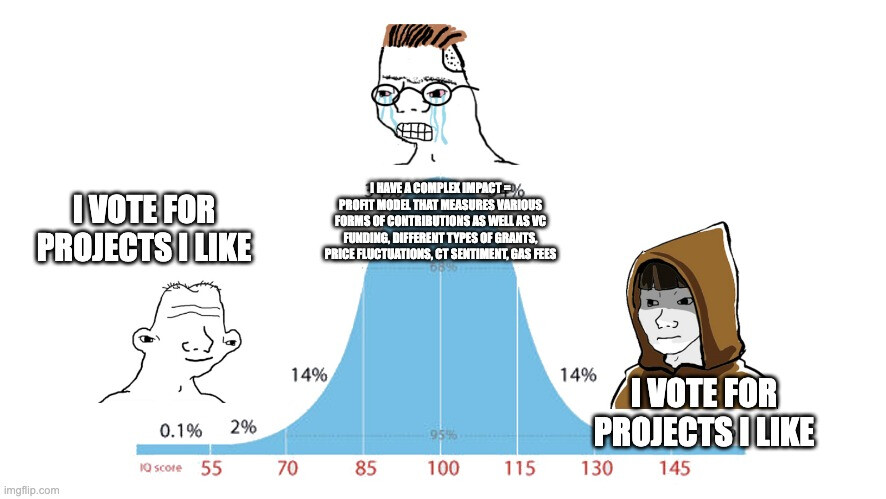

The project’s eventual token distribution was a function of its **median** vote amount. In case you’re rusty on your stats, the use of medians means that a voting result of `(0,1,5000000)` is equivalent to `(1, 1, 1, 1, 1, 5000000)` or `(0, 2)`. A vote of 0 has potential to shift a project’s median to the left – and is therefore a pretty powerful move.

In order to qualify for a payout, a project needed to receive at least 17 votes and a median of more than 1500. There were 142 projects that did not meet these requirements.

You can find more details about the results [here](https://optimism.mirror.xyz/37Bgum6MfTJWDuE41CH9RXSH5KBm_RCL5zsSFeRZl4E).

# **How the votes came in**

The histogram below shows the composition of the 20K+ votes cast, grouped by the amount of OP they awarded to a project. Nearly ⅓ of votes were in the 1500 to 25K OP range.

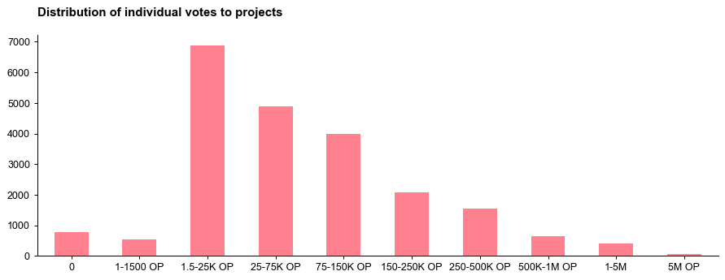

These relatively small votes of 1500 to 25K helped borderline projects meet quorum requirements, but they also had potential to bring down the median of higher impact projects.

Modular Crypto is an example of a project that was quite popular – it received 50 votes, including 18 over 25K - but its median was dragged down by 31 small votes (and one zero).

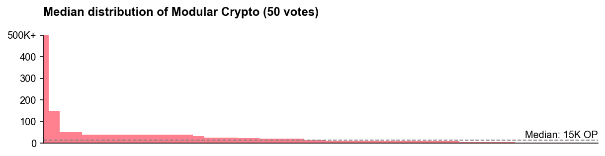

By comparison, Aestus Relay was much less popular – it only received 22 votes – but it benefited from not having a long tail of small votes.

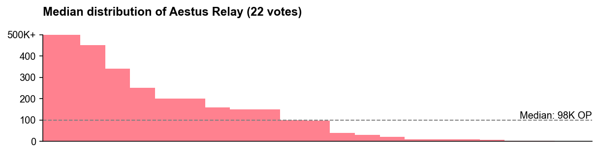

# **Categorizing distribution patterns**

Building on the type of analysis shown above, I plotted the projects along two axes:

* How **well-known** a project is, ie, how many total votes it received. A project was “more well-known” if it received at least 36 total votes.

* How much **variance** a project had in its individual votes. A project had “high variance” if it had a [coefficient of variation](https://en.wikipedia.org/wiki/Coefficient_of_variation) of at least 1.35 (the ratio of its standard deviation to its mean).

Then I assigned each project into a category based on its quadrant in the 2x2 below. (Each dot represents a project.) Each category holds roughly 100 projects in it.

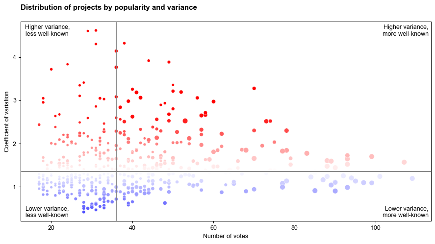

In general, projects that had less variance in their vote distribution had a higher median. More well-known projects also had a higher median.

These patterns are shown in the plot below. (Each dot still represents a project.) Unsurprisingly, the best category to be in is “lower variance, more well-known”.

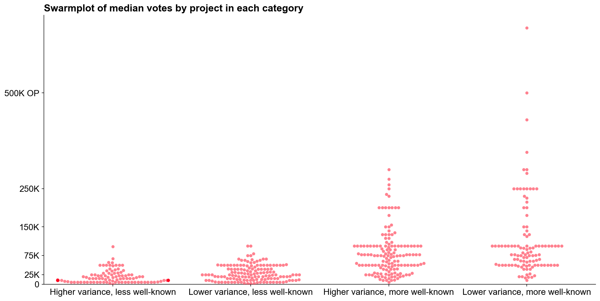

# **There were some divisive projects**

A “divisive” project is one that has a relatively high number of votes at the two extremes of the spectrum, ie, zero and 500K+. For example, Immunefi received 6 votes of 0 OP and 7 votes of 500K OP or more. In total, there were 33 projects that appear to be divisive.

The chart below shows the vote distribution for these projects. (Each dot represents a vote. You can see charts like the one above for the other project categories in the appendix.) The small numbers on the left side of the axis indicate the count of zero votes the project received and the numbers on the right side indicate the count of 500K+ votes. To appear in this chart, a project had to have a least two 0 and at least two 500K+ votes.

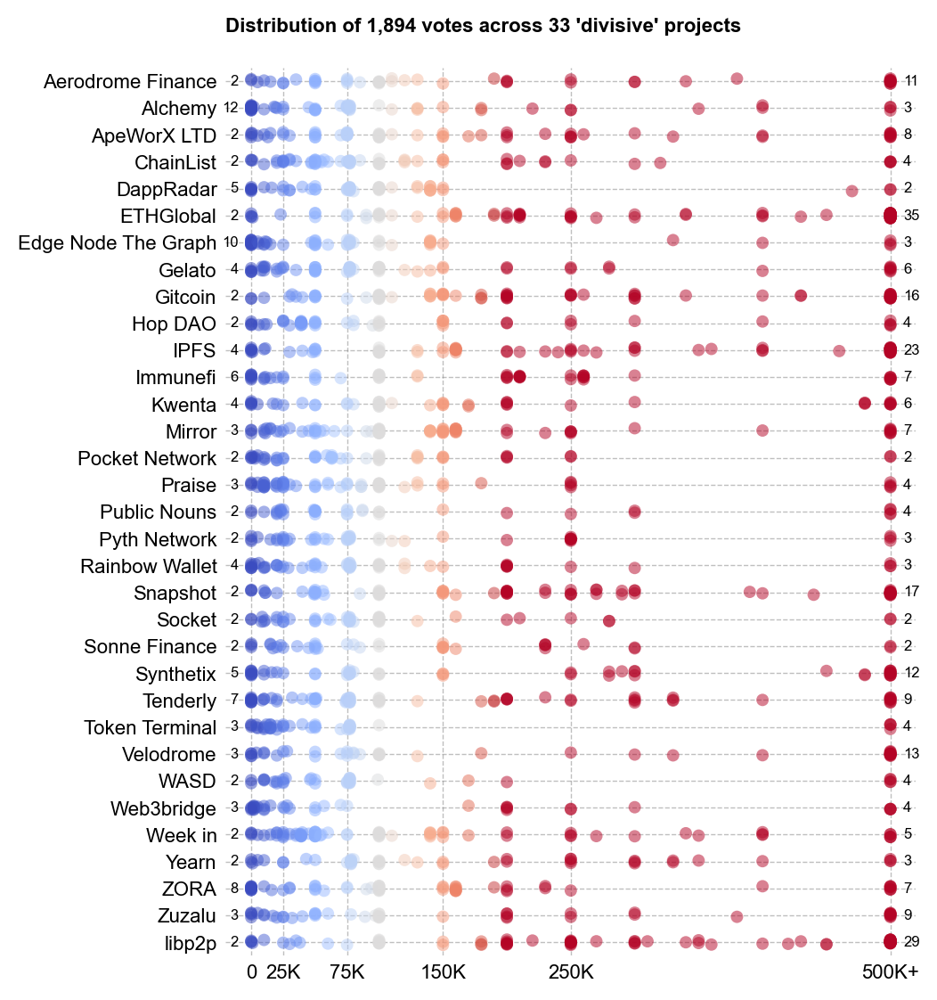

The composition of these projects may reveal some of the Collective’s “[wedge issues](https://en.wikipedia.org/wiki/Wedge_issue)”. A wedge issue is a political or social issue which is controversial or divisive within a usually-united group. In this context, it could be whether a software project has received venture capital or not.

# **The zero vote was a powerful weapon**

Some projects received a lot of zero votes as shown in the table below. In a few cases (eg, NFTEarth), this prevented the project from receiving any RetroPGF. In most cases, the zeros brought down the project’s median.

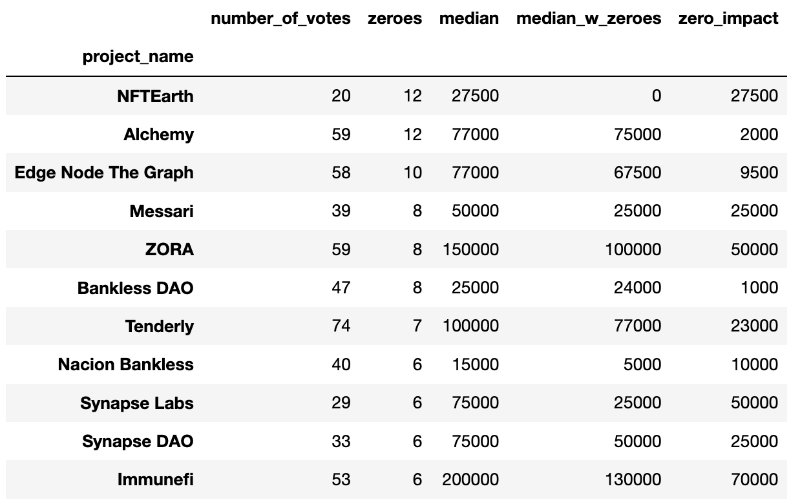

In the case of Immunefi, they had a median vote of 130K OP with 6 zeros in their distribution. The graph below shows the distribution of all votes to Immunefi, and the median of 130K.

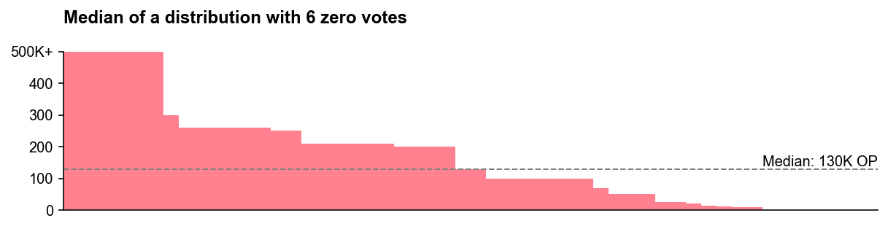

We can model the impact of each zero on Immunefi’s overall allocation. For instance, with 5 instead of 6 zeros, Immunefi would have had a median vote of 165K OP – a large difference. In other words, the additional zero – their 52nd vote – brought their median down by 35K OP.

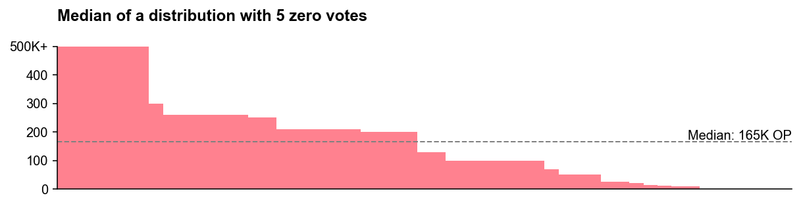

Although the drop of 35K was extreme, the impact of zero votes was not distributed equally. The average zero vote cost a project 2K from its final allocation. The chart below shows the incremental impact of every zero vote that was cast.

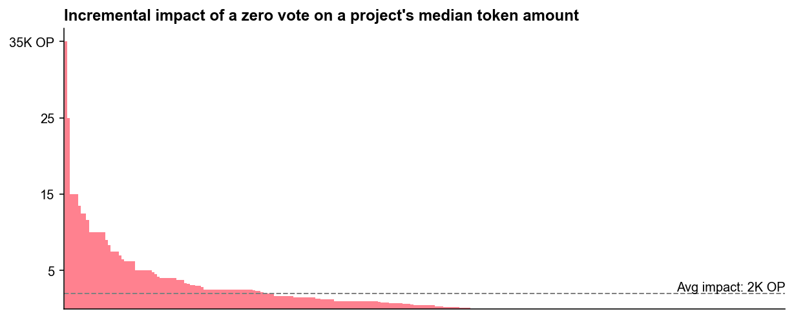

The figure below shows that zeros were a pretty blunt instrument. A single zero caused Solidity, a very popular project with more than 100 other votes, to lose 35K OP. At the same time, Nación Bankless received 6 zeros (out of 40 total votes) and \*only\* lost 10K. This kind of unpredictability could be a drawback of using the median vote amount to determine a project’s overall OP award.

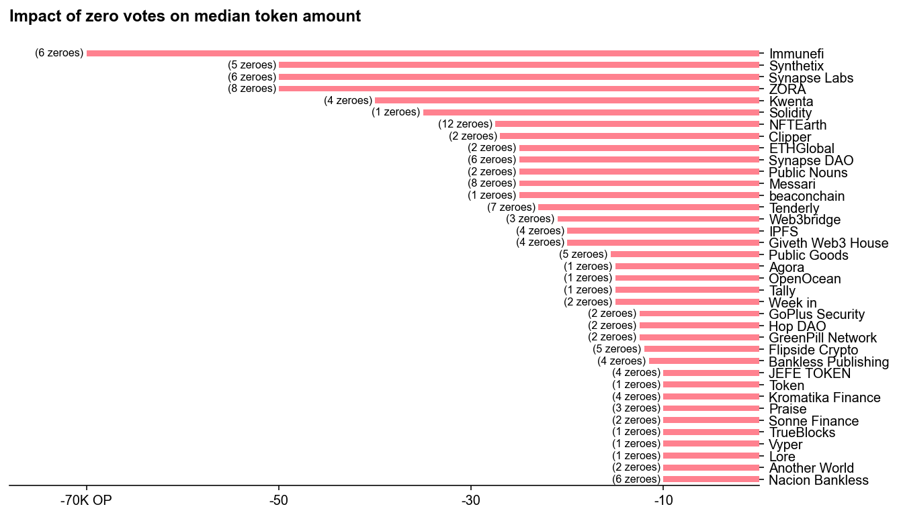

# **Final thoughts**

As I wrote [previously](https://mirror.xyz/cerv1.eth/HikrWg-CneYoHruCON5gCi6BL7R71TEBpdJjgqon9M8), we can only build a better game by studying whether the rules and player dynamics are having the intended effect. With that in mind, here are some thoughts on where to go from here. I believe many of these points are already being addressed by the Optimism Collective.

1. Badgeholders shouldn’t be voting on this many projects, especially if it’s to signal lukewarm support for a project they don’t know much about.

2. The use of the median led to some [counterintuitive results](https://gov.optimism.io/t/retropgf-experimentation-voting-algorithms/7216/2), with voters who “like” a lot of projects reducing the RetroPGF for projects they “love”. It’s worth experimenting with other algorithms that lead to more intuitive voting strategies.

3. Projects that were well-known and didn’t have any haters performed best. To prevent RetroPGF from becoming a [Keynesian beauty contest](https://en.wikipedia.org/wiki/Keynesian_beauty_contest), the Collective should experiment with different round formats, project curation, and ways of surfacing impact metrics in the voting UI.

4. Zero votes, if these continue to be a thing, should probably have a cost associated with them. FWIW, Gitcoin did a [fleeting experiment](https://archive.grants.gitcoin.co/rounds/5) with negative voting.

5. The Collective should identify any wedge issues among badgeholders and seek to mitigate their impact on the voting mechanism. Whether a project has VC funding or not is perhaps the clearest wedge issue, but there are probably others.

I had a lot of fun playing with this dataset and making these exhibits. Below you’ll find the distribution charts from the remaining categories of projects. Again, you can fork my [notebook](https://github.com/opensource-observer/insights/blob/main/analysis/optimism/retropgf3/notebooks/2024-02-07_RetroPGF3_AnonymousVotingAnalysis.ipynb) and take this analysis in other directions.

## Appendix

You can find higher resolution versions of these images, including ones sort projects by **median vote** (not alphabetical), [here](https://github.com/opensource-observer/insights/tree/main/analysis/optimism/retropgf3/voting_analysis).

### Lower variance, more well-known projects

These projects had at least 36 votes and a coefficient of variation below 1.35.

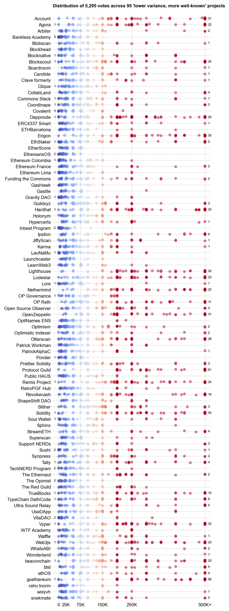

### Higher variance, more well-known projects

These projects had at least 36 votes and a coefficient of variation more than 1.35.

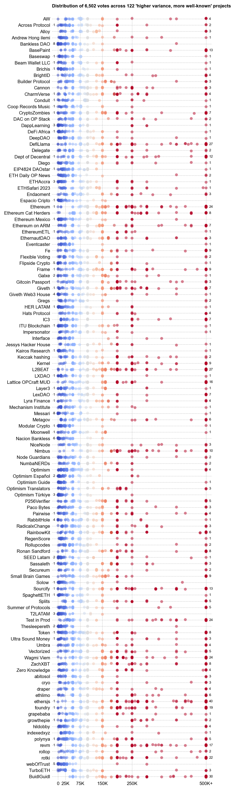

### Lower variance, less well-known projects

These projects had less than 36 votes and a coefficient of variation below 1.35.

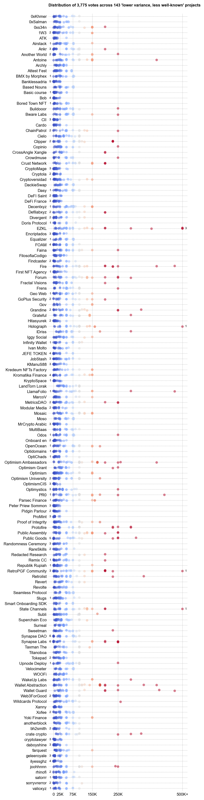

### Higher variance, less well-known projects

These projects had less than 36 votes and a coefficient of variation of more than 1.35.

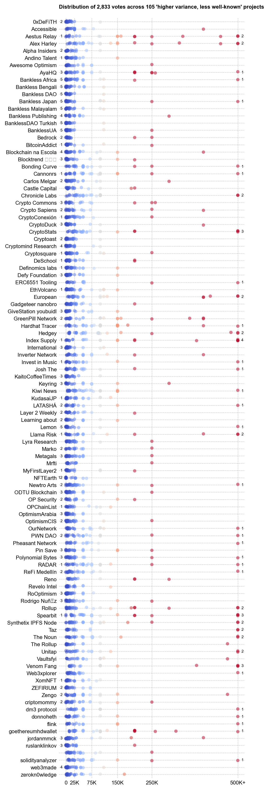

