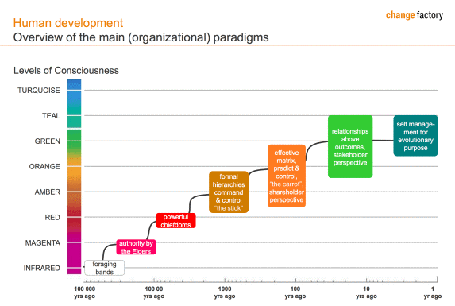
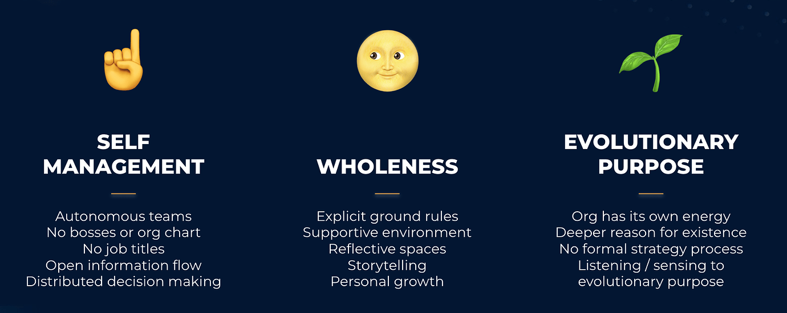
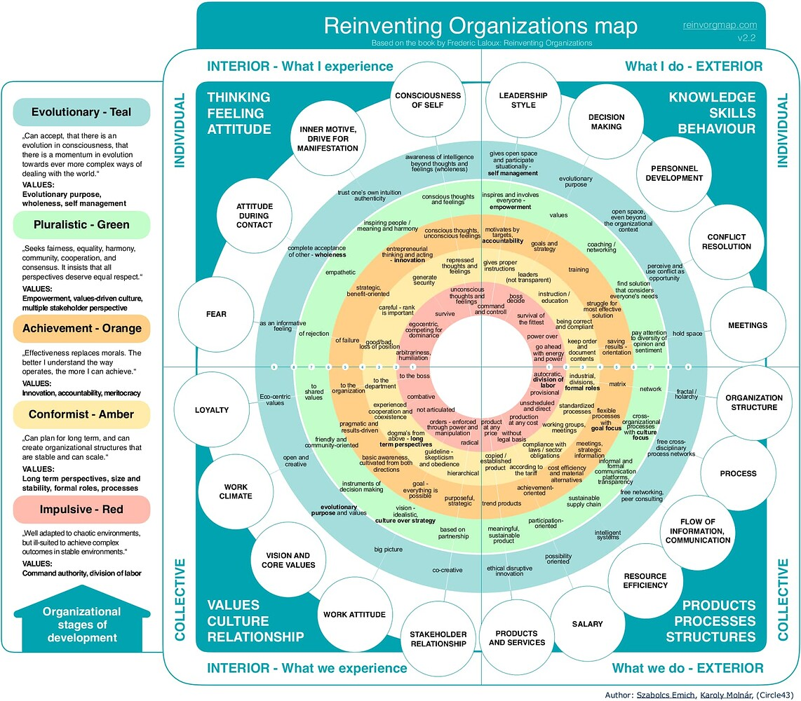

### TLDR - Reinventing Organizations (“Teal”)
  
*May 17, 2022*

> This post originally appeared on [Gitcoin Governance](https://gov.gitcoin.co/t/tldr-reinventing-organizations-teal/10638)

The book [Reinventing Organizations by Frederic Laloux](https://www.reinventingorganizations.com/pay-what-feels-right.html) is a book about DAOs that isn't about DAOs.

It was published in 2014 - the same year as the [Ethereum Whitepaper](https://ethereum.org/669c9e2e2027310b6b3cdce6e1c52962/Ethereum_Whitepaper_-_Buterin_2014.pdf) - and articulates the need for a new organizational model, one that is more soulful, emergent, and holocratic. I feel it's a must-read for folks interested in organizational design and decentralized governance.

Laloux's core thesis is that every time humanity has shifted to a new stage of consciousness, it has invented a whole new way to structure and run organizations. This, in turn, has enabled extraordinary breakthroughs in collaboration.

The book opens with lengthy and persuasive history of human organization. Each level of consciousness has a color associated with it. The **Red** stage emerged 10,000 years ago and brought organizational innovations like having an unimpeachable authority (ie, a chief) and a division of labor among citizens. Next came **Amber**, circa 1000 years ago, which introduced hierarchy, stable roles, and formal processes. These organizational innovations were essential to the spread of religion (eg, the church) and government (eg, monarchies). The **Orange** organization emerged around 100 years ago and is best exemplified by a traditional bank or multinational. Such organizations pioneered concepts like shareholder value, meritocracy, business forecasting, and management through KPIs. The last type of organization to be well represented among popular levels of consciousness is the **Green** organization. Most web2 companies operate at this level of consciousness. Such organizations tend to have flatter management structures and try to do more than just give lip service to social and environmental issues.

While each type of organization had its heyday, each organization is still present in modern life. Most government organizations like public schools, police departments, and courts still operate with amber principles. The [Fortune 500 list circa the Year 2000](https://fortune.com/fortune500/2000/) is a good snapshot of orange organizations (General Motors, Wal-Mart, Exxon Mobil, Citigroup, AT&T) and the current [World's Most Admired companies list](https://fortune.com/worlds-most-admired-companies/) includes a good smattering of green organizations (Apple, Alphabet, Microsoft, Starbucks, Netflix). (If these links are paywalled for you, then you can thank orange consciousness for that.)

After the history section, the rest of the book focuses on a new type of organizational consciousness: **Teal**. Teal organizations replace hierarchy with self-management. The organization is much more like an organism that has emergent properties and an evolutionary purpose. 

There is a lengthy practical section, which explains teal principles and how to implement them. There are no bosses, no job descriptions, no formal strategy process, hardly any budgets. There are explicit ground rules, reflective spaces, open information flow, energy. 

Here is a more elaborate derivation of teal principles and their evolution from early forms of organizational consciousness.

The book also gives several examples of modern organizations that have adopted one or more aspects of teal. The food processing company [Morningstar](https://www.morningstarco.com/) is one such example. I found this vignette about how they handle compensation to be compelling:

> If you work at Morning Star, then once a year, along with all your colleagues, you write a letter stating the raise in salary you believe to be fair for yourself and why. In an uneventful year, you are likely to stick with a cost-of-living adjustment. But if you feel you have taken on more challenging roles or made special contributions, you can choose a higher percentage.
> 
> You then share your letter with a handful of colleagues that were elected into a compensation committee. The committee’s job is to review all the letters it receives, calibrate them, and provide feedback.
> 
> Morning Star’s experience is that people prove to be remarkably skillful at assessing a fair compensation for themselves. In any given year, roughly a quarter of people choose salary increases above the cost-of-living adjustment. Only a handful of people throughout the company receive feedback that they might have aimed too high.

At the time it was published, it was difficult to find examples of organizations that had embraced all aspects of teal. Most of the examples used by Laloux felt to me like dipping a toe in teal waters, not jumping in wholeheartedly. 

But, fast forward to 2022, and the book feels highly relevant to DAOs. Many DAOs exemplify most if not all of these principles.

There are some great resources available if you want to explore the book and its concepts further:
- [Peter Fisk's blogpost from 2019](https://www.peterfisk.com/2019/10/reinventing-organisations-frederic-lalouxs-transformation-from-corporate-hierarchies-to-living-organisms/) has a number of video links and exhibits
- There is a good [wiki](https://reinventingorganizationswiki.com/en/) that includes a list of [case studies](https://reinventingorganizationswiki.com/en/cases/)
- I also hosted a Learning Together session for Dream DAO members a few months ago with slides available [here]((https://docs.google.com/presentation/d/1ACu9D9P9R9JO832UF1JSe6vK7kOypPhD5Tx0qgcDz38/edit?usp=sharing))

Finally, it appears that Frederic Laloux is starting to get involved in the DAO space. [Here](https://soundcloud.com/allforclimate/the-week-reinventing-climate-movements-how-can-we-dao-it) is one such appearance. I would expect him to be fully green pilled in the near future if [@owocki](https://gov.gitcoin.co/u/owocki) hasn't done so already!