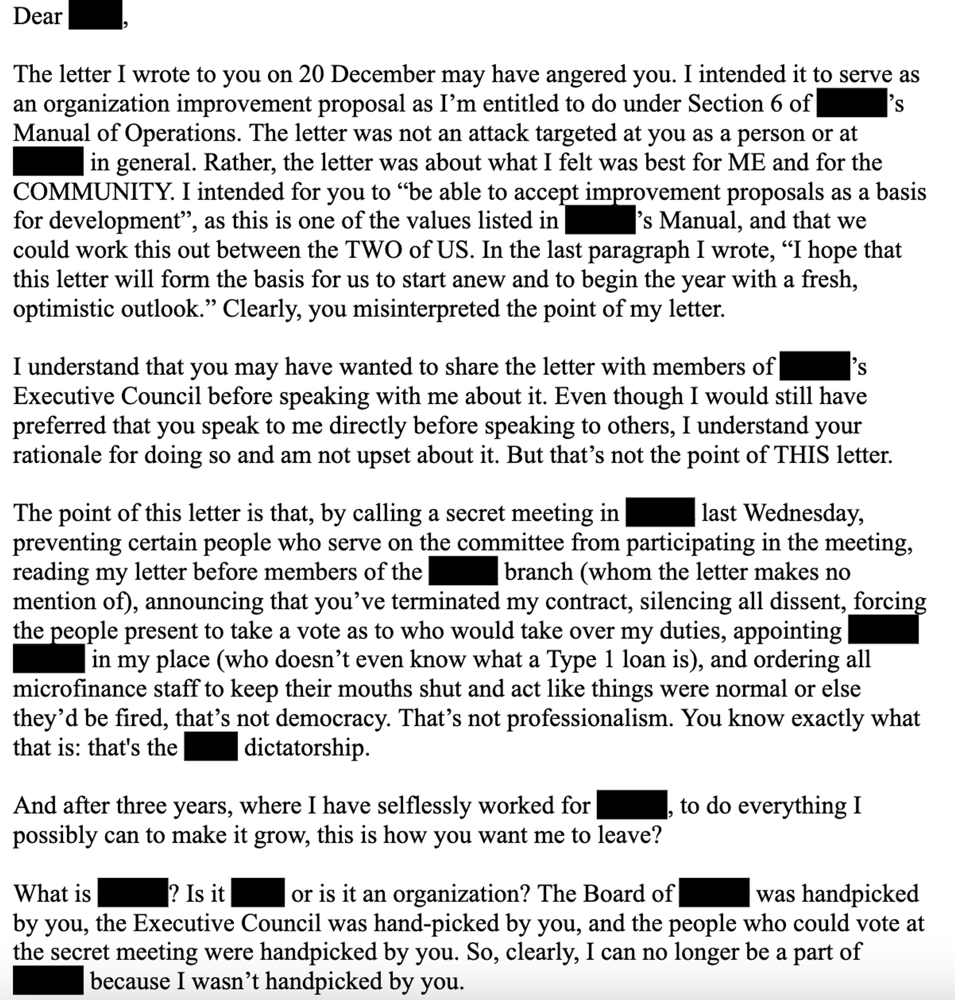

### The most important lesson that I learned in my 20s

Yesterday I half-jokingly called for [a moratorium on nerd sniping](https://x.com/carl_cervone/status/1789327764245316073) in honor of Mother’s Day. As fate would have it, shortly thereafter, I was [nerd sniped](https://xkcd.com/356/) by something that could have easily consumed my weekend: a heated debate about whether to wind down or transfer ownership of an ambitious project that failed to live up to its potential.

I won’t get into details about the project, but it reminded me a formative event that I went through early in my career, with a project that I was deeply invested in and had to give up on.

It was my mom who helped me through that transition. Probably one of the best gifts you can give a parent as an adult is validation that they gave you some good lessons in life, even if you failed to see it that way at the time.

This post is my way of offering some advice to some of the people involved in this kerfuffle and a belated thank you to my mother for her wisdom.

---

I’ll share the lesson first, then the story:

***If you find yourself in strong disagreement with an organization that ultimately you have no real control over, walk away. Channel that energy and passion into building your own thing.***

Resist the temptation to escalate, dig up dirt on the leaders, launch a public campaign. Don’t instigate a civl war. Don’t attempt a coup. Don’t try to sway popular opinion by attacking the legitimacy of a key person or group of decision makers, no matter how angry they make you feel or wronged you feel by their actions.

It’s almost always lose-lose. 

Even if you “win” in the short-term, you usually lose in the long run. Many reasonable people will secretly resent you for forcing them to pick a side. People will be nervous about getting close to you in the future because they’ve seen what you’re capable of. You burn bridges.

Remember: “It takes many good deeds to ***build*** a good reputation, and only one bad one to lose it.” 

Moreover, the rare individual who has the agility, vision, and political savviness to “win” in these situations AND look good while doing so is probably better off building their own movement, not trying to fix someone else’s.

**Think you can do a better job? Take that confidence and create something new.**

---

My mom taught me this lesson about moving on when I was 24.

I had spent most of the last three years, starting from when I was a junior in college, working on a project halfway around the world. My friends graduated and moved to New York; I moved to Tanzania.

I began as a researcher, secured some funding, and eventually launched a microloan program that grew to serve around 500 customers in a small village. I did this under the auspices of a local organization, which had originally helped me with my research. There was an informal arrangement that I could operate autonomously so long as I paid my share of G&A.

After about a year of grinding, the project finally got to the stage where it was operating in the black, we had a competent team in place, and there were even a few outside funders ready to give us more money.

Then, in the span of 48 hours, I was fired, had my residence permit cancelled, and was told I had to walk away from the community of people that I’d worked with closely for the past three years without saying goodbye.

All of this because, a few days earlier, I sent the founder of the organization — let’s call him “Pepe” — a letter with some proposed enhancements to our working arrangement.

I still have a soft copy of the letter. There were three asks:

- A pay raise, from $500 to $2000 per month
- Signatory control of a foreign foundation I’d setup to receive external funding for the microloan program
- A seat at the “big kid’s table” where strategic planning and communications happened — and some ideas for what the agenda should be

I’ll never know if it was one my specific demands that set Pepe off or just the fact that I was an arrogant 24 year old giving unsolicited advice about how to run the organization he founded. Probably the latter. We didn’t have a particularly close relationship or regular 1-1s to broach such issues.

In any case, my life was in a free fall. 

I had to abandon all my dreams and plans for the organization. I had to explain the situation and field difficult questions from our staff, customers, and funders. I had to leave my house and friend circle in Tanzania. I had to start over. In fact, it was worse than starting over because I had lost prime years in my early 20s with nothing to show for it.

(This was what was going through my head at the time.)

Or I could fight back.

I could convene the board. I had examples of Pepe’s missteps and poor decisions as president. I had data to show that virtually all of the financial growth over the past two years had been because of *my* projects. I had funding lined up that could be yanked with one phone call or email from me. And, most of all, I had the backing of the staff and community, who, apparently, had held their own secret meeting and decided they would back me in the event of a standoff.

*The board would have to listen to me and, when forced to choose, the choice would be obvious.*

I had an ace up my sleeve, too. There was one person who had dirt on Pepe. He gave me details of some code of conduct violations and the names of people I could persuade to give testimony. He also warned me of some backhanded tactics that Pepe was prepared to use against me.

---

I can’t recall how close I actually got to staging an emergency board meeting and starring in my own courtroom drama. I still have a soft copy of my talking points in Swahili.

I also have a document simply saved as “mean letter”, which could very well have been my imaginary opening statement in the courtroom.

I’ve copied the first half of the letter below, since it’s in English and gives some insight into my thoughts at the time:

The letter went on and on with this kind of rhetoric.

Fortunately, I never sent that letter. I never had my courtroom moment. I never had the chance to see if I could actually get 51% of the vote.

My mom ended up talking some sense into me.

---

I remember having long phone conversations with my mom, pacing on the grass in front of my house in Tanzania. It was expensive to call Africa back then, before iPhones and services like WhatsApp.

She’d had a similar moment in her own career, albeit much later on, and ended up walking away from her own management position at a mission-driven organization. She founded her own organization, which she ran herself with a small team until she retired a few years ago. 

She talked me down from some of the nuclear options I was considering. She gave me practical advice for how to unwind things, de-escalate, and tidy up a variety of loose ends. 

She kept saying, “you won’t appreciate it now, but you’re actually very lucky to have this kind of experience so young in life”. 

And that was it. I came back home. I was unemployed, living with my parents again.

---

Instead of languishing, I started plotting new ideas.

There were several opportunities that I’d come across in Tanzania that previously I hadn’t had time to dig into but seemed worth pursuing now. I started networking and doing cold outreach. I did research on domains like “social entrepreneurship” and “mobile payments”. I didn’t see it at the time, but my mom provided a lot of kindling for me during my search.

Eventually, we incorporated a nonprofit that could serve as an incubator for some of these ideas. It didn’t have any funding, but it was *mine* so to speak, a vehicle for creating new things.

In the end, the nonprofit never amounted to much: we facilitated a few small grants to Tanzania and eventually it wound down. Instead, I got another call to go back to Tanzania and work with a friend, who, incidentally had been my housemate when I went through the whole ordeal with Pepe three months earlier. Perhaps I’d been auditioning for something else the whole time?

He gave me a hard problem, some resources, and a small team to work with. It wasn’t *my* organization, but it taught me how to build and scale organizations. It was a great run and in two years I was doing things I’d never have been able to do if I’d stayed with Pepe.

After working there in a variety of roles, I went on to start a new organization. I’m now on my second startup. 

---

I’d be lying if I said I learned my lesson back when I was 24. The truth is that I felt bitter about it for many years. Now, however, I have enough perspective to look back at the times I’ve walked way from things and feel OK about it. 

It’s not worth fighting for an organization that isn’t yours, no matter what you think the court of popular opinion will decide.

If you feel that strongly about something, then the world deserves your best version of it. 

To my younger friends, I hope you got a laugh out of seeing my “mean letter” and how ridiculous I would have looked if I’d hit send. At the time, I believed wholeheartedly in every word. 

If I’d decided to wage war and lost, it’s unlikely my friend who observed the whole thing go down would have reached out to me with a job opportunity. And, if I’d won, I might still be in rural Tanzania (not that that’s a bad thing) with a sworn enemy.

I’m not sure how much of the chess board my mom saw at the time, but she definitely talked me back from doing some things I would have regretted. She helped me accept that it was time to move on. She helped me do so with dignity. And she helped me put my energy towards climbing a new hill.

Thank you, Mom.

24-year-old me probably wouldn’t have taken advice from a random blog post or someone else’s mom, but maybe you will. Don’t die on the wrong hill.