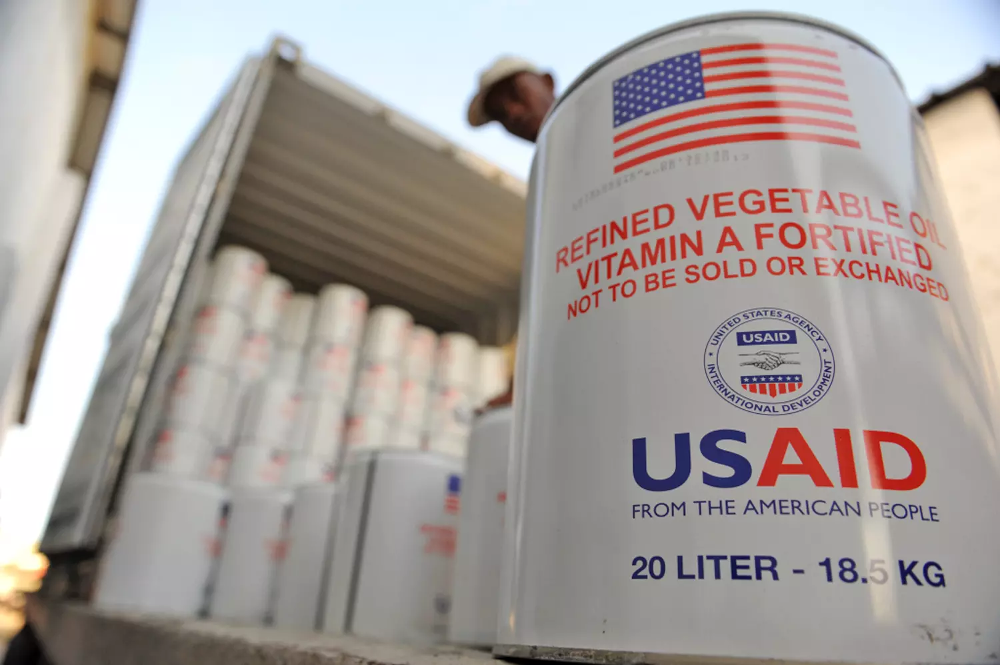

# A Eulogy for USAID

*February 9, 2025*

I was probably 11 or 12 when I saw the National Geographic cover [Tragedy Stalks the Horn of Africa](https://nationalgeographicbackissues.com/product/national-geographic-august-1993/), which showed a skeletal woman clutching a rusted kettle and looking down at her dust-covered bare feet. I don't think I read the article (no one *reads* National Geographic anyway, right?) but the image stuck with me. I had a large collection of National Geographic magazines, which I would often leaf through to clip photos for science projects or collages, and I remember trying to keep that edition at the very back of the stack at all times because the cover was so upsetting.

This was the 1990s, shortly after the first Gulf War, around the time of genocides in Bosnia and Rwanda. However, this was not the time of the big famine in Ethiopia that everyone old than me remembers. *That* famine was a decade earlier, in the 1980s. That famine was the one that Bob Geldof put on [Live Aid](https://en.wikipedia.org/wiki/Live_Aid) to raise money for.

*This* famine was the more run-of-the-mill variety, the kind that didn't make the headlines or cause outpourings of public sympathy. A slow burn. People in the US had become accustomed to mainstream depictions of tragedy in places like Somalia or Ethiopia: starving children, parched fields, flies buzzing around hollow faces.

The role of international development, coming from agencies like USAID and their counterparts in other rich countries, was to provide longer-term, non-emergency support to countries in need. Donor governments would fund projects in agriculture, infrastructure, education, and more, with the goal of helping countries become more self-sufficient over time and prevent really bad things like famines from happening in the first place.

---

## Business Solutions to Poverty

About 10 years later, I would end up moving from the US to East Africa—first as a researcher and eventually as a salaried employee of a USAID-funded NGO called TechnoServe.

TechnoServe's motto was “business solutions to poverty,” a tagline that might resonate with the people currently dismantling USAID, but back then was ahead of its time. This was an era when “aid” and “business” were rarely mentioned in the same sentence. TechnoServe was actually one of the first international development NGOs—founded in the 1960s—and was a small, scrappy outfit for most of its history. But it was built on the belief that business can be a force for good, that people want *jobs*, not handouts.

In practice, this meant TechnoServe would often take the harder route to get things done. If a group of farmers needed equipment, TechnoServe would spend a year helping them write a business plan, find financing, and learn how to operate the machinery. It also helped with the operational nuts and bolts: bookkeeping, staff training, and more.

TechnoServe never just handed out equipment and called it a day. That principle was drilled into everyone when they joined the organization. TechnoServe tended to recruit people from the private sector—people who viewed questions like “How should we finance this productive asset?” through a more business-minded lens. It was slower, sometimes more expensive, and it didn't lend itself to flashy photo-ops. But more often than not, it yielded better results than traditional aid.

I joined TechnoServe to work on a coffee project in Tanzania. I happened to know Swahili, had a decent head for numbers, and liked running farmer trainings. I never actually interviewed for the job—my future boss was my housemate at the time.

The project I worked on was considered big for TechnoServe but tiny for USAID (just a few million dollars). My first task involved helping a group of farmers broker an export financing deal and sell coffee to Starbucks. I enjoyed the hands-on nature of the work, and after six months I moved to Kenya to replicate what we’d done in Tanzania. Again, USAID stepped in as a funding partner, giving our fledgling coffee team the resources it needed. There was a “small grants” program available, and we got a five-figure check to get started.

Later that year, the Gates Foundation took notice and gave TechnoServe its largest grant ever to scale our coffee work in East Africa. I spent the next few years working on [The Coffee Initiative](https://www.technoserve.org/fight-poverty/projects/coffee-initiative/) in Kenya, Rwanda, and eventually Ethiopia. It’s now seen as one of the most successful coffee development programs in history, boosting incomes for a quarter of a million households and building hundreds of farmer-owned businesses that still operate profitably (and supply some of the best coffee in the world).

None of that would have been possible without USAID’s early support.

---

## Fly America

Another thing I learned when I joined TechnoServe was that being a USAID-funded NGO came with lots of rules and oversight.

Auditors combed through our expenses, making sure not a single beer had been paid for with U.S. government funds. Flights were scrutinized for compliance with the [Fly America Act](https://www.gsa.gov/policy-regulations/policy/travel-management-policy-overview/fly-america-act), meaning we often had to pick a more inconvenient carrier if it flew under a U.S. flag.

I was pretty junior, so I probably didn’t see the full extent of the bureaucracy, but I did see how TechnoServe had built an entire internal system just to deal with USAID’s requirements: budgets, financial reports, monitoring and evaluation, quarterly progress reports, etc. Everything had to match a specific format, and any deviation could get the whole submission rejected. For someone who just wanted to get things done, it could be maddening to spend so much time on documentation.

I also contributed to proposals for USAID funding, which required a huge investment of time, energy, and personnel—3–4 people in a “proposal team,” plus a dozen specialists for technical input. These proposals were fiercely competitive, and many DC-based, for-profit companies (Chemonics, Winrock, etc.) specialized in winning big USAID contracts. They often overshadowed nonprofits like TechnoServe that were more nimble on the ground but less polished on paper.

The media has been quick to blame NGOs for capturing USAID's agenda, but in my experience, it was the DC-based contractors who were the most powerful force shaping USAID's agenda (and the best at profiting from its inefficiencies).

---

## The Expat Lifestyle

One of the most striking parts of the USAID ecosystem was the expat lifestyle. I saw mid- to senior-level project managers come in—often from the U.S.—to oversee multi-million-dollar grants. They’d earn tax-free salaries, have their housing and transportation covered, and if they had families, schooling and annual flights home were provided too. In East Africa, that translated to an extremely comfortable existence.

For a while, I found the idea of being a permanent expat tempting. It was an easy path to a good salary, a houseful of helpers, and dinners at fancy hotels on the donor's dime. Yet I was never comfortable with how insular it felt—clusters of foreign consultants behind high walls, physically in the country but not truly *of* it.

That tension mounted. I worried that if I followed the easy path, I’d wake up at 60 with regrets about never trying to work again in the U.S. So I made the call to leave and head back home. Ostensibly, I was going to learn the business development side of TechnoServe’s work, but in truth, I think I needed to see if I could still fit in back in America.

I never did move back to East Africa for work. Sometimes I wonder what might have happened if I stayed—maybe I’d be behind the wheel of a white Toyota Land Cruiser right now, living my guarded compound and driving to a dinner party at the InterContinental Hotel. But something in me just couldn’t embrace that lifestyle.

---

## Follow the Money

Looking under the hood of many projects, you’d see that a staggering portion of each grant went to overhead and salaries for contractors in Washington, DC, or expats in-country. By the time you accounted for flights, consultant fees, and administrative overhead, half the budget might be gone before hitting any direct project costs. Even TechnoServe, with its emphasis on lean operations, had to devote a hefty share to meeting donor reporting requirements.

Agriculture projects, while important, weren’t the biggest line items for USAID. Huge sums went to drug-eradication efforts in Latin America—often with dubious outcomes—and even more to post-war interventions in places like Iraq and Afghanistan, which contended with corruption, insecurity, and other hazards. 

Then there was humanitarian assistance. This often felt like a brand exercise for the U.S. government. I remember walking through rural Ethiopia and seeing children fetching water with recycled metal containers of cooking oil labeled “From the American People,” as if it were a PR campaign.

Because USAID is both a donor agency and a tool of U.S. foreign policy, it was frequently an instrument for adding “carrots” to the more complex “sticks” of diplomacy and security.

---

## Outliers

Still, for all its red tape, some USAID-supported programs genuinely shone. The President’s Emergency Plan for AIDS Relief (PEPFAR)—launched under George W. Bush—remains one of the most successful global health campaigns ever. It poured resources into HIV testing, antiretroviral treatments, and community education, dramatically lowering infection rates and saving countless lives. PEPFAR is proof that large-scale government aid, when well-structured, can accomplish extraordinary things.

My own work with TechnoServe was another outlier. USAID took a chance on a small, scrappy organization whose approach many other donors found too complex or difficult. The “business solutions to poverty” mantra was unorthodox at the time, but it led to real transformations for farmers and cooperatives on the ground.

Many on the right have been quick to ridicule some of the projects USAID has supported in recent years, like a $47K grant to ["trans opera" in Colombia](https://colombiaone.com/2025/02/04/colombia-opera-trans-usaid/). Unless things have changed radically during the years I've been out of the scene, I have to assume that such projects are outliers as well. My bet is that the big money from USAID is still flowing to all the usual themes-infrastructure, health, agriculture, poverty reduction, etc.-and being captured by the same old contractors in DC.

---

## Where It All Stands Now

Today, USAID is in the crosshairs of the Trump administration, facing a very real threat of being permanently shuttered or severely defunded. I’m conflicted. I’ve seen the colossal inefficiencies and the comfortable expat bubbles. I’ve seen plenty of projects designed to make the donor happy that fail horribly at implementation. 

But I also know of many early USAID grants that launched entire careers (including mine) and made tangible improvements for countless families.

I’m no fan of the current dismantling strategy and its callousness, but I admit part of me thinks it’s time to let USAID die. It was created in another era. It's probably time for a new container to send contributions "from the American people" abroad.

Yet if it disappears entirely—if we hastily bury the largest source of U.S. international development funding in a partisan grave—it won’t magically fix the dysfunctions we all witnessed, and it will surely plant seeds for future dysfunction.

So consider this piece a eulogy. I mourn the imminent loss of a force whose energies, however flawed, could be harnessed for some good in the world. My hope is that whatever rises from the wreckage—a reimagined agency or a mosaic of smaller, more nimble initiatives—clings to that simple, human impulse to care about the suffering of others. If that impulse withers along with USAID, then we will truly have lost something irreplaceable.